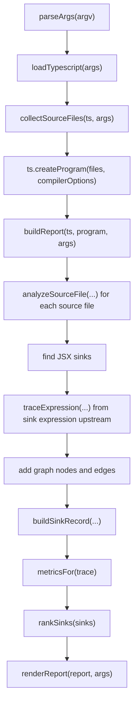

# Render-Path Data-Flow Analyzer

This document explains the render-path data-flow analyzer (`tsx-dataflow`) implemented in:

- `bin/tsx-dataflow.mjs` — CLI entrypoint.
- `src/core.mjs` — all analysis behavior.
- `test/core.test.mjs` — Vitest coverage over fixture projects.

The analyzer is an advisory static-analysis tool for Solid/SolidStart UI code. It builds a typed graph from source expressions to JSX render sinks, then projects that graph into work packets, ledgers, path views, and JSON dossiers. Its purpose is to find render code where values are repeatedly wrapped, defaulted, converted, relayed, or defensively checked after the TypeScript program already proves those checks unnecessary.

## Command Surface

The CLI entrypoint is `bin/tsx-dataflow.mjs`, exposed as the `tsx-dataflow` binary. It delegates all behavior to `src/core.mjs`. Run it from the target project root; `--source` and `--tsconfig` are auto-discovered when omitted:

```bash
tsx-dataflow \
  --view work-packets \
  --format markdown \
  --out .tsx-dataflow/work-packets.md
```

Run the test suite:

```bash
pnpm test
```

Supported views:

| View | Purpose |
| --- | --- |
| `work-packets` | Ranked implementation items with scope, reason, representative path, candidate edits, and risk queue. |
| `findings` | Compact finding report with severity, source, sink, metrics, and explanation. |
| `dossier` | Markdown summary or bounded JSON graph payload for downstream inspection. |
| `fan-out` | Sources that reach many sinks. |
| `fan-in` | Sinks with many upstream roots or predicates. |
| `path-gallery` | Representative source-to-sink paths. |
| `path-census` | Aggregate source/sink/path-depth counts. |
| `path-families` | Grouped signatures such as `object-pack -> call -> fallback -> jsx-sink`. |
| `transformation-ledger` | Step-by-step path transformations for the top finding. |
| `defensive-ledger` | Defensive operations and their nullish type verdict. |
| `prop-relay` | Relay-like paths and wrapper counts. |
| `repair-map` | Ranked quick-win, central-leverage, and investigation queues. |

Common options:

| Option | Behavior |
| --- | --- |
| `--root <path>` | Project root. Defaults to the current working directory. |
| `--source <path>` | Source root. Defaults to `./src`, then `./app/src`, then the root. |
| `--tsconfig <path>` | TypeScript config. Defaults to the nearest tsconfig.json. |
| `--typescript-from <path>` | Extra location used to resolve the TypeScript package. |
| `--format json\|markdown` | Output format. |
| `--scope <text>` | Filters output by file, sink label, or root source substring. |
| `--max-items <n>` | Bounds displayed findings and JSON graph rows. |
| `--baseline <path>` | Compares current worst burden score to a prior JSON report. |
| `--fail-on-regression` | Makes the CLI exit nonzero only when the baseline regresses. |
| `--include-tests` | Includes `.test.*` and `.spec.*` files. |

## High-Level Pipeline



The implementation deliberately uses the TypeScript compiler API directly rather than a separate AST wrapper. This keeps the tool dependency-light and lets it use the target repo's installed `typescript` version.

## Source Loading

`parseArgs` normalizes every path early. Relative `--source` and `--tsconfig` paths are resolved against `--root`; `--out` and `--baseline` are resolved against the current working directory because those are operator outputs, not source inputs.

`loadTypescript` tries to resolve the `typescript` package from several target-local locations:

1. `--typescript-from`
2. the tsconfig directory
3. the source root
4. `<root>/app`
5. the project root
6. the current working directory
7. this package's own directory (the bundled `typescript` dependency)

If no TypeScript package resolves, the tool fails with an install-oriented error. It does not vendor TypeScript.

`collectSourceFiles` prefers tsconfig parsing through `ts.readConfigFile` and `ts.parseJsonConfigFileContent`. When no tsconfig exists, it walks the source directory. `shouldAnalyzeFile` then filters files:

- includes `.ts`, `.tsx`, `.js`, `.jsx`, `.mjs`, `.cjs`
- excludes `.d.ts`
- requires the file to be under `--source`
- skips generated/noisy directories such as `node_modules`, `dist`, `build`, `.solid`, `.vinxi`, `.output`, `coverage`, and `styled-system`
- excludes tests unless `--include-tests` is present

## Graph Model

The graph is a simple in-memory directed graph:

```ts
{
  nodes: [],
  edges: [],
  nextNodeId: 1,
  nextEdgeId: 1,
  root
}
```

Every node has:

- `id`
- `kind`
- `label`
- `file`
- `location`
- `type`

Every edge has:

- `id`
- `from`
- `to`
- `kind`
- `unknown`
- `location`

The graph is intentionally append-only during a run. It does not deduplicate equivalent syntax nodes. That makes the generated path and location evidence straightforward, at the cost of larger dossiers.

Important node/edge kinds:

| Kind | Meaning |
| --- | --- |
| `source` | Known source identifier such as a prop, parameter, or local value. |
| `unknown-source` | Identifier or operation source the local file context cannot resolve. |
| `literal` | Literal or untraced terminal expression. |
| `alias` | Local variable indirection. |
| `property-read` | `.property` or element access. |
| `optional-read` | Optional property access with a defensive nullish check. |
| `call` | Function or method call. Local helpers are partially inlined. |
| `object-pack` | Object literal or spread aggregation. |
| `fallback` | Nullish coalescing or logical fallback. |
| `conditional` | Conditional expressions and boolean/control expressions. |
| `template` | Template expression composition. |
| `solid-accessor` | Solid `createMemo`, `createSignal`, or `createResource` accessor boundary. |
| `jsx-sink` | Final JSX rendered value, attribute, style, or render-control sink. |

## File Context

Before tracing a file, `buildFileContext` walks the source file and records:

- `variables`: local variable declarations by identifier
- `functions`: function declarations and variable-owned arrow/function expressions
- `accessors`: recognized Solid accessors from `createMemo`, `createSignal`, and `createResource`
- `parameters`: function parameters, used to distinguish known roots from unknown identifiers

The context is intentionally file-local. It does not resolve imported helper bodies across files. Imported or otherwise unresolved helpers become unknown edges, which moves findings toward the investigation queue instead of pretending the path is fully known.

## Sink Discovery

`getSinkExpression` identifies render sinks in JSX:

1. `JsxExpression` children become `rendered-value` sinks.
2. JSX attribute expressions become:
   - `event-handler` when the attribute name matches `on[A-Z]`
   - `style` for `class`, `className`, and `style`
   - `render-control` for `when` and `each`
   - `attribute` otherwise

Event handlers are collected in `sinks` for visibility but are excluded from ranking. This keeps click handlers and callbacks from dominating render-path cleanup work.

Each sink receives a `jsx-sink` graph node and an edge from the traced upstream expression to that sink node.

## Expression Tracing

The core algorithm is `traceExpression`. It walks upstream from a sink expression and returns a trace object:

```ts
{
  lastNodeId,
  roots,
  edges,
  defenses,
  longestPath,
  unknown
}
```

The returned trace is both a graph-construction result and a compact summary used for metrics.

### Cycle Guard

The tracer carries a `stack` set of AST expression nodes. If an expression repeats during recursion, the tool emits a `cycle` source trace marked unknown. This prevents infinite loops in recursive local expressions or pathological AST shapes.

### Identifiers

Identifier tracing has three paths:

1. If the identifier is a recognized Solid accessor, delegate to `traceAccessor`.
2. If it is a local variable with an initializer, trace the initializer and wrap the result in an `alias` operation.
3. Otherwise emit a `source` or `unknown-source` terminal.

An identifier is considered known when it is a parameter or a recorded declaration. It is considered unknown when neither condition is true.

### Solid Accessors

The analyzer recognizes common Solid data-flow boundaries:

- `createMemo`: traces the memo callback return expression and records a `solid-accessor` operation.
- `createSignal`: traces the initial signal value when present and records a `solid-accessor` operation.
- `createResource`: records an unknown `solid-accessor` source boundary. Resource values usually cross async/server boundaries, so the current implementation does not inline them.

This gives useful paths for memo-derived render values without pretending that async resource contents are locally knowable.

### Property And Element Access

Property access traces the receiver first, then adds a `property-read` operation. Optional property access uses `optional-read` and records a defense entry.

Element access is modeled as `property-read` over the receiver. The current implementation does not deeply distinguish literal indexes from dynamic keys in the metrics.

### Calls

Call tracing handles local helpers and external/unknown calls differently:

- Local identifier calls are matched against the file context's `functions` map.
- If a local helper has a return expression, the tracer follows the call arguments and the helper return expression, then records a `call` operation.
- Accessor calls such as `fullName()` are routed through `traceAccessor`.
- Method calls and unresolved calls trace their receiver/arguments and record a `call` operation marked unknown when the callee is not a known local function.

The local helper model is intentionally shallow. It captures common render helper patterns, but it does not bind function parameters to call arguments. This means it is good at finding helper-heavy paths and unknown boundaries, but not a full interpreter.

### Object Literals

Object literals become `object-pack` operations. The tracer follows:

- spread assignments
- property assignment initializers
- shorthand property assignments

This is the main signal for representation churn: values being repeatedly repacked into intermediate view models before reaching JSX.

### Fallbacks And Conditionals

`traceBinaryExpression` classifies `??` and `||` as `fallback`, and other binary operations as `conditional`.

For `??`, it records a defense entry against the left-hand expression. That defense is later classified by the TypeScript checker as:

- `impossible`: the checked type contains no `null` or `undefined`
- `possible`: the checked type can be nullish
- `unknown`: the checked type is `any`, `unknown`, or a type parameter

Conditional expressions trace the condition, true branch, and false branch into a `conditional` operation. Prefix unary expressions are also represented as control/conditional operations.

### Templates And Assertions

Template expressions become `template` operations over their interpolated spans.

Parentheses, `as` expressions, and non-null assertions are transparent: the tracer continues into the wrapped expression rather than creating a separate node.

## Defense Classification

`defenseRecord` stores:

- operation kind
- full defensive expression
- guarded expression
- TypeScript type text
- verdict
- source location

`getNullishStatus` uses `checker.getTypeAtLocation` and inspects union members:

1. If any member is `any`, `unknown`, or a type parameter, the verdict is `unknown`.
2. If any member is `null` or `undefined`, the verdict is `possible`.
3. Otherwise the verdict is `impossible`.

This is why the tool can flag cases such as a `??` fallback on a plain `string` or a branch guarded by a value that was already clamped into a non-null range.

## Metrics

`metricsFor` converts the trace into numeric features:

| Metric | Source |
| --- | --- |
| `sliceSize` | Number of trace edges plus representative path length. |
| `maximumPathDepth` | Length of the longest representative path. |
| `helperHops` | Count of `call` edges. |
| `representationChurn` | Count of `object-pack`, `object-spread`, and `alias` edges. |
| `defensiveOperationCount` | Count of `fallback` and `optional-read` edges. |
| `impossibleDefenseCount` | Defense entries with verdict `impossible`. |
| `controlDependencyCount` | Count of `conditional` edges. |
| `mergeWidth` | Number of distinct root sources feeding this sink (fan-in). |
| `reachableSinks` | True downstream reach: how many render sinks this sink's most-central source also feeds, computed across the whole report by `groundReachability`. |
| `repeatedNormalization` | Defensive operation count after the first defense. |
| `unknownEdgeCount` | Count of unknown trace edges. |

`reachableSinks` is the one metric that is not a single-trace property. The trace graph does not deduplicate nodes across sinks, so downstream reach cannot be read off the raw graph per source node. Instead `groundReachability` aggregates by source identity (label): a source's reach is the number of distinct render sinks its *actionable* roots feed (literals, bare parameter objects, and unresolved globals are excluded — see "Source Roots And Fan-Out"). Each sink inherits the reach of its most-central source. This grounds centrality and the queue split in real fan-out rather than a constant.

The remaining metrics are intentionally approximate; the tool is designed for ranked cleanup guidance, not formal proof.

## Source Roots And Fan-Out

Each trace carries `rootInfos` alongside `roots`: a list of `{ label, kind }` descriptors where `kind` is the terminal node kind (`source`, `parameter`, `prop-read`, `literal`, `unknown-source`, `solid-accessor`, `cycle`). The first concrete property read off a parameter is refined into a qualified `prop-read` root (`props` → `props.meta`) so that fan-out keys on the value that actually flows rather than the whole props object.

`fanOutRootsFor` defines what counts as an actionable fan-out "source" and is reused by both the `fan-out` view and reachability:

- `literal` roots (`0`, `false`, `""`, `[]`, `null`) are excluded — they are not ownable.
- bare `parameter` roots (a whole `props` object) are excluded — too coarse to be one source.
- unresolved language globals (`undefined`, `Math`, `JSON`, …) are excluded.
- `prop-read`, named `source`, and other `unknown-source` roots are kept.

## Ranking And Queues

`rankSinks` computes burden, centrality, change risk, and derived queue scores for every non-event sink.

### Burden Score

`burdenScore` emphasizes:

- path depth
- helper hops
- representation churn
- defensive operations
- type-impossible defenses
- control dependencies
- repeated normalization

Each raw value is normalized with `log1p(value) / log1p(20)` and clamped to `[0, 1]`.

### Centrality Score

`centralityScore` combines:

- true downstream reach (`reachableSinks`, weighted highest)
- path depth
- helper hops
- merge width
- slice size

Reach is the dominant term, so a source that feeds many render sinks outranks an equally-deep but isolated one. This replaced an earlier constant base-reach term that existed before `groundReachability` computed real fan-out.

### Change Risk Score

`changeRiskScore` increases with:

- downstream reach (`reachableSinks`) — editing a widely-used source touches more sinks
- unknown edges
- control dependencies
- helper hops
- slice size

High-risk items can still rank highly, but they are less likely to be presented as quick wins.

### Queues

`queueFor` assigns each sink:

- `investigation` when unknown edges or unknown defense verdicts exist
- `central-leverage` when downstream reach is in the report's top quartile (a per-run relative threshold, floored at 3) or maximum path depth is above 10
- `peripheral-quick-win` otherwise

The reach cutoff is computed in `groundReachability` from the report's own `reachableSinks` distribution rather than a fixed constant, so it adapts to codebase size and keeps `central-leverage` a meaningful minority (about the top ~30% of ranked sinks on the modeler corpus) instead of the ~50% an absolute `> 2` cutoff produced.

`rankSinks` then sorts:

- `all` by burden
- `quickWins` by quick-win score
- `centralLeverage` by central leverage score
- `investigations` by investigation priority

## Report Construction

`buildSinkRecord` creates the user-facing sink record:

- stable-ish id based on source location, such as `RPF-042-13`
- file, line, and column
- category and label
- expression text
- TypeScript type text
- root labels
- representative path (the longest source→JSX label chain, as plain strings)
- representative steps (the same chain with a per-step `kind`: `property-read`, `fallback`, `call`, `object-pack`, `solid-accessor`, …) — surfaced in the path/ledger renderers
- graph node id
- metrics
- defenses
- confidence
- queue

`confidenceFor` is heuristic:

- `72` when unknown edges exist
- `80` when defense verdicts are unknown
- `99` when impossible defenses exist
- `88` otherwise

The high confidence for impossible defenses reflects that those are grounded in the TypeScript checker, not merely path-shape heuristics.

## Output Projection

The tool has one internal report model and many projections.

Markdown renderers produce human-readable reports. JSON output returns `selectViewPayload`, which includes:

- `analysisVersion`
- `generatedAt`
- `summary`
- selected `view`
- ranked sink records up to `--max-items`
- bounded graph only for `dossier`
- optional baseline result

For JSON dossiers, `boundedGraph` returns only the first `--max-items` nodes and edges plus `omittedNodes` and `omittedEdges`. This prevents accidental massive output while preserving the report's shape.

### Markdown Formatting

Every Markdown view opens with a blockquote `viewIntro` note (provenance plus a one-glance description of the view and its terms) so a report stands alone without the analyzer source.

Two presentation conventions keep reports readable:

- **Code-like payloads** (sink expressions, source roots, the representative path, ledger/defensive expressions) are rendered as fenced code blocks or backtick code spans. `formatExpression` first collapses internal whitespace/newlines to a single line and truncates on a token boundary with a trailing `…`, so a multi-line object literal never shatters the layout and nothing is cut mid-identifier. `code()` picks a backtick-run delimiter longer than any run inside the value, so expressions that embed template literals still render as a single code span.
- **Metric/value payloads** render as small two-column tables (`metricTable`) or bulleted lists rather than fenced text, because aligned numbers read better as a table than as monospaced prose.

`formatMarkdownTable` lays out every table prettier-style: each column is padded to its widest cell and the separator dashes fill the same width, computed on *visible* width so an escaped pipe (`\|`, which GFM renders as one character) still aligns. `formatTableCell` escapes newlines and pipe characters so tables stay valid when cells contain multi-line code or union types.

The `fan-out` view reports `Source | Sinks | Files | Example sink | Max depth`: an example `file:line` and file count let a reader open the right file without re-grepping, replacing the former opaque `Operations` slice-size sum.

## Baseline Comparison

Baseline comparison is intentionally simple:

1. Read a prior JSON report.
2. Compare the current worst burden score to `baseline.sinks[0].scores.burden`.
3. Mark `regressed: true` when current worst is larger.

This supports a lightweight guardrail for cleanup campaigns. It does not compare individual findings by stable identity yet.

## Test Coverage

`test/core.test.mjs` uses temporary TypeScript fixture projects and Vitest. Covered behaviors include:

- CLI validation for formats and views
- JSX sink category collection, with event handlers excluded from ranking
- graph construction for local helpers and unknown imported helpers
- `createMemo` and `createResource` modeling
- renderers for findings, work packets, ledgers, and JSON dossier payloads
- baseline regression comparison

Run:

```bash
pnpm test
```

## Known Limits

The analyzer is useful but intentionally not a complete data-flow engine.

- It is file-local for helper bodies. Imported helpers are unknown boundaries.
- It does not bind local helper parameters to call arguments.
- It does not deduplicate graph nodes for repeated identical syntax.
- Downstream reachability (`reachableSinks`) is aggregated by source label, not by traversing a deduplicated graph, since nodes are not shared across sink traces.
- It does not model all Solid primitives or router/server-action data APIs.
- It treats element access coarsely.
- It treats many method calls as unknown, even when they are common pure transforms.
- It reports candidate evidence; every high-ranked work item should be spot-checked before editing.

These limits are deliberate for the first version. The tool favors fast, explainable, low-dependency analysis that can point a developer to render-path hotspots.

## Extension Points

Good next improvements:

1. Add parameter binding for local helper calls so `helper(props.user)` can map `user` to `props.user` inside the helper body.
2. Add imported helper summaries for same-project imports.
3. Deduplicate graph nodes by source file and syntax span.
4. Traverse a deduplicated graph for sink reachability instead of aggregating by source label (the current `groundReachability` approach), to capture reach through shared intermediate operations.
5. Add SolidStart-specific source/sink kinds for resources, actions, route params, and server query outputs.
6. Group work packets by shared helper or source root to reduce repeated adjacent findings.
7. Improve representative path formatting for long expressions.
8. Compare baselines by finding signature instead of only worst burden.

## Operational Guidance

Use the bundled skill `skills/render-path-dataflow-work/SKILL.md` when acting on analyzer results. Its default mode is to fix the worst grounded finding, then re-run the analyzer and final checks. For larger campaigns it defines batch and loop modes, but analyzer output should remain advisory: source inspection decides whether a finding should become code changes.
