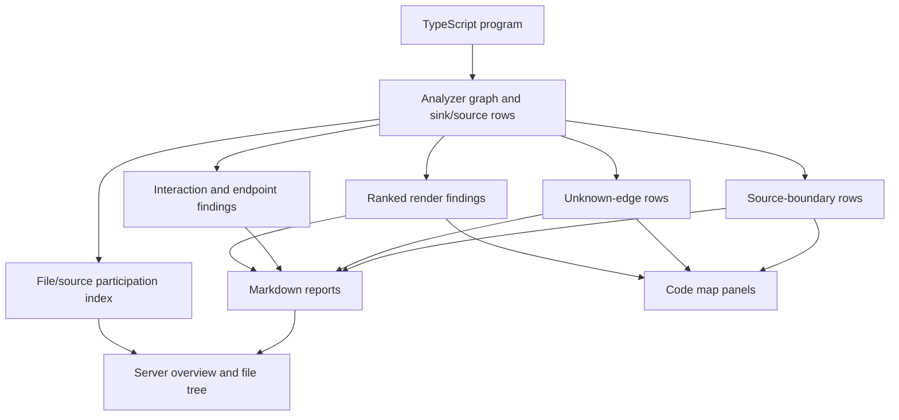

# Plan: Page Review Fix Bundles

## Summary

Implement the Product Grid `Review 6/24` feedback as bundled improvements to the `tsx-dataflow` analyzer and local HTML server. The work should improve project-level navigation, make the code-map view easier to scan, expand what the analyzer can explain beyond ranked TSX render sinks, and add targeted reports for unknown edges and source boundaries.

---

## Problem Frame

The current server already gives a useful file overview and a per-file code map, but the review notes show that users still have to hunt for important context: non-TSX files disappear when they do not host JSX sinks, report markdown assets are not discoverable from the index, path lists wrap into hard-to-scan prose, and several analysis findings live below the code instead of near the relevant source. The analyzer also has partial support for newer needs: it collects event-handler sinks but excludes them from rankings, traces helpers across files, and has hotspot/boundary/inline-preview reports, yet it lacks dedicated surfaces for unknown edges, app-edge source files, endpoint sinks, and wall-of-props pass-through patterns.

---

## Requirements

- R1. The server overview must support finding files and reports by search, filter, and sort without leaving `/`.
- R2. The overview must expose generated markdown report assets and project-level rollups so users do not have to know CLI output paths.
- R3. The sidebar and per-file navigation must be predictable, with all report sections accessible by default and no inconsistent hidden state.
- R4. The code map must make multi-line sinks, path hops, and cross-file path steps readable at a glance.
- R5. Report evidence that is currently below the code map must become reachable from the code-focused workflow without forcing users to scroll through every markdown section.
- R6. Non-TSX source files that participate in render paths must be visible even when they do not contain JSX sinks.
- R7. The analyzer must distinguish render sinks, event-handler/interactive sinks, and API/endpoint sinks in a way that keeps existing render-path rankings stable by default.
- R8. Unknown edges must have a dedicated investigation report listing unresolved calls, identifiers, files, and representative paths.
- R9. Source-boundary reporting must show which files and symbols sit at the edge of the app graph, including whether they are props, hooks, helpers, resources, endpoints, or unresolved sources.
- R10. Wall-of-props pass-through patterns must be scored as a unit and must recommend preserving the object boundary when field-by-field prop splitting adds no value.
- R11. Any srcly integration must be additive and optional; `tsx-dataflow` must remain useful without running srcly.

---

## Key Technical Decisions

- KTD1. Keep render rankings stable while adding new sink classes. Event handlers and endpoint sinks should be collected into separate report projections first, with an explicit CLI option or view controlling whether they influence priority rankings. This avoids turning interaction plumbing into noise for users looking at render cleanup.
- KTD2. Treat the local server as the navigation layer, not a second analyzer. Search, filter, sort, report links, and source-file discovery should project from `report`, `REPORT_VIEWS`, and existing file/source metadata rather than re-tracing code in `src/server.mjs`.
- KTD3. Add compact structured report data before improving HTML. Unknown-edge and source-boundary views should expose JSON-friendly row data in `src/core.mjs`; the HTML server can then render the same information as tables, jump links, and code-map badges.
- KTD4. Model non-TSX visibility as graph participation. Files should appear when they contain reached helpers, sources, endpoint handlers, or unknown-edge locations, not merely because they match a broad extension scan.
- KTD5. Keep srcly as an optional enrichment pass. A bridge can join srcly file metrics to `tsx-dataflow` file groups, but core scoring and tests must not depend on a srcly binary or external report.

---

## High-Level Technical Design

---

## Implementation Units

### U1. Overview Search, Filters, Sorting, And Report Assets

- **Goal:** Make `/` the project command center for files, reports, and rollups.
- **Files:** `src/server.mjs`, `src/html/page.mjs`, `test/server.test.mjs`, `README.md`, `docs/analyzer.md`.
- **Pattern References:** Reuse `hotspotGroups(report, "file")`, `REPORT_VIEWS`, `VIEW_LABELS`, `renderOverview`, and the existing `/api/report.json` response shape.
- **Plan:** Add query-param driven search/filter/sort to `renderOverview`: search by file path, dominant shape, ownership, and first cut; filter by files with findings, unknown edges, or graph participation; sort by burden, finding count, path depth, and file path. Add a report-assets section that links each `REPORT_VIEWS` markdown projection, either through a new `/report?view=<name>` route or downloadable `/api/report.<view>.md` route. Keep the sidebar expanded and grouped by file/report categories.
- **Test Scenarios:** In `test/server.test.mjs`, assert `/` renders a search form, sortable links preserve query params, filtered file rows exclude non-matches, report asset links exist for every `REPORT_VIEWS` entry, and unknown routes still return 404.

### U2. Code Map Readability And Path-Hop Surfacing

- **Goal:** Make per-file code review usable when findings span multi-line expressions or involve helper steps from other files.
- **Files:** `src/html/code-map.mjs`, `src/html/source-peek.mjs`, `src/html/page.mjs`, `src/server.mjs`, `test/server.test.mjs`.
- **Pattern References:** Extend `rangeOnLine`, `renderCodeLine`, `pathSection`, `snippetBlockHtml`, and `peekReferences` rather than introducing a separate source viewer.
- **Plan:** Render multi-line sink spans with start/middle/end styling and compact labels so a wrapped sink reads as one selected finding. Convert the path list in the panel from a prose-like ordered list into a denser table with columns for step number, kind, symbol/expression, file, and line. Add inline hop markers or a side-list for representative path steps that occur in the current file, and keep cross-file steps clickable through source-peek popovers. Add small per-finding links from the code panel to relevant markdown sections like unknown edges, boundary report, inline preview, and work packets.
- **Test Scenarios:** In `test/server.test.mjs`, assert multi-line spans highlight all touched lines, path rows include file/line/kind cells, cross-file path steps preserve source-peek popovers, and clicking a same-code xref still selects the correct finding.

### U3. Graph Participation For Non-TSX Files And App-Edge Sources

- **Goal:** Show files that matter to data flow even when they do not host JSX sinks.
- **Files:** `src/core.mjs`, `src/server.mjs`, `test/core.test.mjs`, `test/server.test.mjs`, `docs/analyzer.md`.
- **Pattern References:** Build on `collectSourceFiles`, `shouldAnalyzeFile`, `buildHelperReport`, `boundary-report`, `junctions`, `inline-preview`, and `relativePath`.
- **Plan:** Add a `fileParticipation` rollup to the report that combines ranked sink files, reached helper files, unknown-edge files, context-relay files, and source-boundary files. Expose those files on the overview and file tree with badges like `findings`, `helpers`, `unknowns`, `sources`, and `endpoints`. Keep analysis scoped to `SOURCE_EXTENSIONS`; the fix is about visibility of participating non-TSX files, not analyzing arbitrary assets.
- **Test Scenarios:** In `test/core.test.mjs`, create a TS helper file reached from a TSX render path and assert it appears in `fileParticipation` with no local JSX sink. In `test/server.test.mjs`, assert the overview links to participating non-TSX files and the per-file page renders a source-only state when no ranked sinks exist.

### U4. Interactive And Endpoint Sink Coverage

- **Goal:** Explain important non-render code paths without polluting default render-path cleanup rankings.
- **Files:** `src/core.mjs`, `test/core.test.mjs`, `docs/analyzer.md`, `README.md`.
- **Pattern References:** Extend `getSinkExpression`, existing `event-handler` classification, `rankSinks`, `renderMarkdownView`, and report view registration through `REPORT_VIEWS`.
- **Plan:** Add separate projections for `interaction-sinks` and `endpoint-sinks`. Keep event handlers collected but excluded from `rankings.all` unless an explicit mode is added later. For endpoints, start with first-party exported route handlers and functions that return serialized response-like values; record the final outgoing expression as an endpoint sink with category, file, line, type, roots, unknown edges, and representative path. Document the scope as static and advisory rather than a framework-complete endpoint detector.
- **Test Scenarios:** In `test/core.test.mjs`, assert event handlers appear in the new interaction projection while staying out of default rankings. Add endpoint fixtures for a route returning JSON and a non-endpoint helper, asserting only the outgoing response expression is classified as an endpoint sink.

### U5. Unknown Edge And Source Boundary Reports

- **Goal:** Give users direct investigation tools for unresolved graph areas and app-edge source files.
- **Files:** `src/core.mjs`, `src/server.mjs`, `test/core.test.mjs`, `test/server.test.mjs`, `docs/analyzer.md`.
- **Pattern References:** Reuse `graph.edges`, `unknownEdgeCount`, `fanOutRows`, `buildHelperReport`, `renderBoundaryReport`, and `viewIntro`.
- **Plan:** Add an `unknown-edges` view that groups unknown graph edges by file, line, edge kind, unresolved label, and affected representative sinks. Add a `source-boundaries` view that groups source roots by file/symbol/kind and shows which sinks they feed. Link both views from the overview cards and per-file code-map panels. Keep the current summary `Unknown edges` card, but make it navigable into the new report.
- **Test Scenarios:** In `test/core.test.mjs`, assert unresolved imported calls and unknown identifiers produce grouped unknown-edge rows with affected sinks. Assert source-boundary rows distinguish props, locals, imported helpers, resources, and unresolved roots. In `test/server.test.mjs`, assert overview cards link to the corresponding report routes.

### U6. Wall-Of-Props Unit Scoring And Recommendations

- **Goal:** Detect field-by-field pass-through wrappers and recommend object-boundary preservation when that is the simpler design.
- **Files:** `src/core.mjs`, `test/core.test.mjs`, `docs/analyzer.md`.
- **Pattern References:** Build on `computeWorkUnits`, `computePackGroups`, `sinkFamilyOf`, `firstCutFor`, `candidateEditsFor`, `prop-relay`, and pack verdict evidence.
- **Plan:** Add a pass-through object relay detector for components that destructure or split an object only to pass fields to another component or recombine them into the same conceptual object. Score the pattern as a shared work unit instead of independent small sinks. Emit recommendation prose that says to pass the object through as one prop when the receiving component already consumes the object shape, while preserving the existing overpacked-object split recommendation for mixed-responsibility bags.
- **Test Scenarios:** In `test/core.test.mjs`, assert a fixture that splits `user.name`, `user.email`, and `user.role` only to pass them down becomes one work unit with an object-boundary recommendation. Assert a fixture that splits fields for independent rendering does not trigger the pass-through recommendation.

### U7. Optional Srcly Bridge

- **Goal:** Combine file-level code-quality hotspots with render-path burden without making srcly required.
- **Files:** `src/core.mjs`, `src/server.mjs`, `test/core.test.mjs`, `test/server.test.mjs`, `README.md`, `docs/analyzer.md`.
- **Pattern References:** Follow the optional input style used by `--baseline` and `--compare`; do not shell out from core analysis.
- **Plan:** Add an optional `--srcly-report <path>` flag that reads a precomputed srcly JSON report and joins file metrics onto `hotspotGroups` and `fileParticipation`. Surface srcly-backed columns only when present, and keep the file overview unchanged otherwise. Defer live srcly execution to user tooling or a later integration.
- **Test Scenarios:** In `test/core.test.mjs`, assert a small srcly fixture decorates matching files and ignores missing files. In `test/server.test.mjs`, assert overview columns appear only when srcly data is present.

---

## Sequencing

1. Land U1 first so the project-level navigation and report asset routing exist before new report views are added.
2. Land U2 next because it is mostly HTML projection over existing sink data and directly improves the screenshots with path wrapping and code-hop pain.
3. Land U3 before U4 and U5 so non-TSX participation can be reused by endpoint, unknown-edge, and source-boundary reports.
4. Land U4 and U5 as analyzer/report expansions; both add views and should share report registration and server linking patterns.
5. Land U6 after the report surfaces are stable because its output affects work-packet prioritization and recommendation wording.
6. Land U7 last as an optional enrichment path after native file rollups are reliable.

---

## Scope Boundaries

- This plan does not replace the markdown report system; it makes reports discoverable and adds focused views.
- This plan does not make endpoint detection framework-complete. The first implementation should cover common exported handlers and response-returning functions with clear documentation.
- This plan does not require live srcly execution. It only accepts an optional precomputed report file.
- This plan does not broaden source collection to arbitrary file types beyond the current source extension set.
- This plan does not change default ranked render findings to include event handlers or endpoint sinks.

---

## Acceptance Examples

- AE1. Given a project with many files, when the user opens `/`, then they can search for a file, sort by worst burden or file name, filter to unknown-edge files, and open every generated report asset from the page.
- AE2. Given a finding whose JSX expression spans multiple lines, when the user opens its file page, then every line in the span is visibly connected to the same finding and the panel shows a compact path table.
- AE3. Given a render path that calls a helper in `src/view-models.ts`, when that helper file has no JSX sinks, then the overview still lists it as a participating helper/source file.
- AE4. Given an `onClick={submit}` handler, when the analyzer runs with default settings, then the handler is visible in the interaction sink report but absent from default render rankings.
- AE5. Given a route handler returning a JSON response, when the analyzer runs, then the outgoing value appears as an endpoint sink with roots, type, and unknown-edge evidence.
- AE6. Given an unresolved imported helper, when the analyzer runs, then the unknown-edge report lists the helper location, kind, affected sinks, and a first file to inspect.
- AE7. Given a component that splits an object into fields only to pass those fields down, when work units are computed, then one shared unit recommends passing the object through instead of treating each prop field as an unrelated sink.

---

## Risks And Dependencies

- The server currently uses inline CSS and JS in `src/html/page.mjs`; U1 and U2 should keep that model unless the UI becomes large enough to justify a separate asset pipeline.
- Endpoint sink detection can easily overreach. Keep the first version conservative and label uncertain cases as investigation entries rather than high-confidence findings.
- More report views increase navigation noise. Grouping reports in the sidebar and overview is part of the requirement, not optional polish.
- File participation rollups must respect `--file`, `--scope`, and `--include-tests` so focused reports do not show unrelated files.

---

## Sources

- Product Grid context pack: `tmp/context-pack-page-review-6-24/context-pack.md`
- Export metadata and screenshots: `tmp/context-pack-page-review-6-24/context-pack.json`
- Analyzer and report core: `src/core.mjs`
- Local server overview and per-file pages: `src/server.mjs`
- Code map renderer: `src/html/code-map.mjs`
- Source peek renderer: `src/html/source-peek.mjs`
- Server and HTML tests: `test/server.test.mjs`
- Analyzer tests: `test/core.test.mjs`
