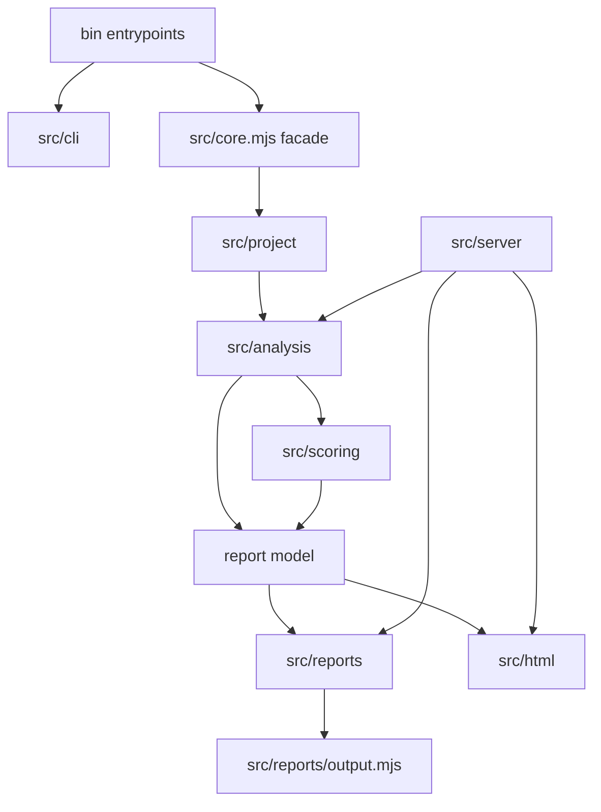

# Plan: Deep Structural Refactor And Test-Only Functionality Audit

## Summary

Refactor `tsx-data-flow` from a few large mixed-responsibility files into crisp modules with stable facades, smaller tests, and an explicit public API boundary. The work should preserve current CLI, server, report, and example-generation behavior while shrinking `src/core.mjs` from 8k+ lines toward a compatibility facade, ideally under 200 lines and certainly nowhere near 5000.

The refactor should also audit code that exists mainly because tests import it. The immediate example is `writeAllReports`: the behavior is real because `bin/tsx-dataflow.mjs` uses it for `--view all --out <dir>`, but the `src/core.mjs` public re-export is only protected by the facade-export smoke test and should not be preserved automatically.

---

## Audit Verification (2026-06-29)

> Commentary added during a plan-audit pass. Each claim below was checked against the working tree on `round8-reports-shell-viz`.

- **File sizes and existing seams: confirmed.** `src/core.mjs` 8296, `src/html/code-map.mjs` 1788, `src/html/page.mjs` 948, `src/server.mjs` 919, `test/core.test.mjs` 2970, `test/server.test.mjs` 1468. The early-extraction modules listed in the Problem Frame all exist. Note the current test tree is still coarse: only `test/cli/server-flags.test.mjs`, `test/integration/{golden,facade-exports}.test.mjs`, and `test/helpers/{fixture-project,golden,http}.mjs` exist alongside the two monoliths — every `test/<owner>/` folder named in the implementation units is net-new.
- **The facade is wider than the prose implies: 24 exports, not 2–3.** `test/integration/facade-exports.test.mjs` locks an exact list of 24 symbols. The audit must classify *all* of them, not just `writeAllReports`. Production-caller analysis (grep over `src/` + `bin/`, excluding the `core.mjs` definition/re-export) splits them cleanly — see the expanded table in the audit section below. The standout finding: **seven facade exports have no production caller at all** — `BANNED_SUGGESTION_IDENTIFIERS`, `classifyPathShape`, `findDefaultSource`, `findDefaultTsconfig`, `findingTitle`, `loadTypescript`, `sinkFamilyOf`. These are the real accidental-API surface, and the plan currently names only one of them.
- **`writeAllReports`/`writeReport` reach `bin` *through the facade*.** `bin/tsx-dataflow.mjs` imports both from `../src/core.mjs` (not from `src/reports/output.mjs`). So privatizing them off the facade is not just a test edit — `bin` (and therefore `examples/regenerate.mjs`, which shells out to `bin`) must be repointed to `src/reports/output.mjs`. U1 should call this out explicitly.
- **The golden test does not read the committed example reports.** `test/integration/golden.test.mjs` calls `buildGoldenReport()` / `fetchGoldenApiReportJson()` from `test/helpers/golden.mjs`, which build the report in-memory from the fixture *source* and snapshot it (`test/integration/__snapshots__/golden.test.mjs.snap`). The committed `examples/bad-ish-solid/reports/*.md` files therefore have **zero automated coverage** — they are pure documentation artifacts. This strengthens the case for treating stale generated reports as safe-to-regenerate dead weight (U13).
- **`regenerate.mjs` already self-heals: confirmed.** It does `rm -rf reports/` → `mkdir` → one `bin/tsx-dataflow.mjs --view all --out reports` pass (with `--max-items 8`). No per-view delete logic is needed; R10/U13's "self-heal" assumption holds.
- **Example reports are doubly stale, in both directions.** Against the current `REPORT_VIEWS`, the committed `examples/bad-ish-solid/reports/` has **8 retired files present** (`dossier`, `hotspots`, `path-census`, `path-gallery`, `repair-map`, `source-boundaries`, `transformation-ledger`, `unknown-edges`) **and 2 current views missing** (`overview.md`, `component-refs.md`). The plan's Dead-Weight section lists the retired files (correctly, including `path-gallery.md`) but omits the missing-current-view half. A single `pnpm examples:regenerate` fixes both directions at once.
- **Current `REPORT_VIEWS` (14, for reference):** `overview, findings, repeated-forks, work-packets, fan-out, fan-in, path-families, defensive-ledger, prop-relay, context-relay, boundary-report, junctions, inline-preview, component-refs`. Plus the `all` meta-view and `coverage`→`overview` alias.

---

## Problem Frame

The codebase already has a few early extraction seams: `src/cli/args.mjs`, `src/cli/help.mjs`, `src/cli/server-flags.mjs`, `src/project/*.mjs`, `src/analysis/graph.mjs`, and `src/reports/output.mjs`. Those modules prove the intended direction, but most behavior still lives in large files:

| File                    | Current size | Main issue                                                                                                                       |
| ----------------------- | -----------: | -------------------------------------------------------------------------------------------------------------------------------- |
| `src/core.mjs`          |   8296 lines | Owns analysis orchestration, tracing, detectors, scoring, report rendering, compare logic, and many public exports.              |
| `src/html/code-map.mjs` |   1788 lines | Mixes code-line rendering, inventory rows, detail panels, report-entry panels, and SVG graph rendering.                          |
| `src/html/page.mjs`     |    948 lines | Stores page shell, CSS, and browser script in one module.                                                                        |
| `src/server.mjs`        |    919 lines | Mixes HTTP routing, analyzer caching, page rendering, route state, API payloads, and rich report viewers.                        |
| `test/core.test.mjs`    |   2970 lines | Mixes CLI parsing, TypeScript project loading, analysis behavior, scoring, rendering, compare, file filters, and shape guidance. |
| `test/server.test.mjs`  |   1468 lines | Mixes HTML utilities, code-map rendering, graph SVGs, server route behavior, and page state.                                     |

Large files are making local edits expensive because the reader must hold unrelated concerns at the same time. The refactor should move code by ownership boundaries, not by arbitrary line-count slicing. It should leave the tool behavior stable while making each future change land in the module that owns that behavior.

---

## Requirements

- R1. Preserve CLI behavior for `tsx-dataflow`, including `--view all`, `--format json`, `--compare`, `--baseline`, `--file`, `--scope`, `--out`, and regeneration footers.
- R2. Preserve server behavior for `tsx-dataflow-serve`, including analyzer caching, `/`, `/report`, `/file`, `/api/report.json`, markdown API routes, `/refresh`, `/healthz`, and error responses.
- R3. Keep `src/core.mjs` as a compatibility facade during migration, but make it shrink as implementation leaves; the final facade should re-export only intentional public symbols.
- R4. Split analyzer construction, TypeScript project loading, file context, tracing, detectors, scoring, report projection, compare logic, and filesystem output into named modules with one-way dependencies.
- R5. Split HTML rendering so page shell assets, markdown HTML conversion, source peek, code-map source rendering, code-map panels, inventory rows, and SVG graphs can be edited independently.
- R6. Split server routing from server page/view rendering while preserving the one-analyzer-per-server cache model.
- R7. Split tests by behavior owner and keep integration tests only where TypeScript program construction, filesystem output, or HTTP routing is part of the contract.
- R8. Audit every exported helper and every test helper for production use. Remove or privatize code whose only reason to exist is that tests import it.
- R9. Treat `writeAllReports` as the model case for the audit: keep the CLI directory-output behavior, but decide whether the helper should remain exported from `src/reports/output.mjs` and `src/core.mjs` based on production/API ownership rather than the facade smoke test.
- R10. Remove stale generated example reports and stale active-doc references to retired views only after the current supported report surface is explicit.
- R11. Do not introduce a catch-all `utils` layer for core behavior. Shared helpers should live near the domain that owns them.
- R12. Preserve behavior with characterization checks before each risky extraction. The golden output and facade export smoke tests can guard moves, but they should not freeze accidental APIs forever.

---

## Key Technical Decisions

- KTD1. Facade first, but not facade forever. `src/core.mjs` should stay import-compatible while modules move, then be reduced to a documented public facade. Anything only imported by tests should be challenged before it remains on the facade.
- KTD2. Public API is a product decision. The package exposes bins and ships `src`, but there is no documented library API in `package.json` exports. Use README/docs/bin usage as the default contract, and classify direct source imports as compatibility until the user chooses to document them.
- KTD3. Separate app services from reusable helpers. A function like `writeAllReports` may be valid as CLI application code even if it should not be a public core export. The audit should distinguish “delete the behavior” from “make the behavior private to the owning layer.”
- KTD4. Build module boundaries around data ownership. Project modules should produce TypeScript programs and routing metadata; analysis modules should produce report models; scoring modules should annotate analysis facts; reports/html/server modules should project those facts.
- KTD5. Extract tracing last among core internals. The tracer is the highest-risk area because tiny context changes can alter many reports. Move low-coupling project, rendering, scoring, and detector seams first.
- KTD6. Keep markdown reports and HTML views separate. Markdown rendering belongs under `src/reports`; web UI rendering belongs under `src/html`; HTTP concerns belong under `src/server`.
- KTD7. Move tests after the owning modules exist. The first test refactor should extract common helpers and add characterization coverage; broad test-file splitting becomes safer when each target module has a home.
- KTD8. Retired-view compatibility is explicit, not accidental. Old `dossier.md` and `transformation-ledger.md` compare parsing should survive only if comparing old report directories is a supported promise.

---

## High-Level Technical Design



> Arrows above denote orchestration/data flow, **not** import direction. Import direction is the inverse along the core pipeline: `analysis` imports `project` (to consume a built program), `scoring`/`reports`/`html` import the report model, and `server` imports `analysis`/`reports`/`html`. This matches the Risks section rule that `project` must never import `analysis`.

Target source layout:

```text
src/
  core.mjs                         # thin compatibility/public facade
  cli/
    args.mjs
    help.mjs
    server-flags.mjs
  project/
    discovery.mjs
    files.mjs
    tsconfig.mjs
    typescript.mjs
  analysis/
    analyzer.mjs                   # analyzeProject/createAnalyzer/analyzeProgram orchestration
    report-builder.mjs             # buildReport and report object assembly
    graph.mjs
    file-context.mjs
    sink-discovery.mjs
    helpers.mjs
    repeated-forks.mjs
    context-relay.mjs
    component-refs.mjs
    tracing/
      trace-core.mjs
      trace-identifiers.mjs
      trace-calls.mjs
      trace-operations.mjs
      defenses.mjs
      cross-file.mjs
  scoring/
    metrics.mjs
    ranking.mjs
    selection.mjs
    work-units.mjs
    shapes.mjs
    guidance.mjs
  reports/
    render.mjs
    json.mjs
    compare.mjs
    output.mjs
    markdown/
      shared.mjs
      overview.mjs
      findings.mjs
      repeated-forks.mjs
      work-packets.mjs
      fan.mjs
      path-defense-relay.mjs
      boundaries.mjs
      component-refs.mjs
  html/
    escape.mjs
    page.mjs                       # shell wrapper only
    styles.mjs
    client-script.mjs
    markdown-to-html.mjs
    source-peek.mjs
    code-map/
      index.mjs
      source-lines.mjs
      path-panel.mjs
      finding-panel.mjs
      inventory.mjs
      report-entry-panels.mjs
      graphs.mjs
    report-viewers.mjs
  server/
    create-server.mjs
    cache.mjs
    routes.mjs
    overview.mjs
    file-page.mjs
    report-page.mjs
    state.mjs
```

---

## Public API And Test-Only Functionality Audit

The refactor should add an explicit audit step before preserving any export. Classify each exported symbol as one of these categories:

| Category                     | Keep where                                                      | Examples                                                                                      |
| ---------------------------- | --------------------------------------------------------------- | --------------------------------------------------------------------------------------------- |
| Documented user behavior     | Bin scripts, docs, route handlers, stable facades               | `tsx-dataflow --view all`, `/api/report.json`, `parseArgs` only if documented as library API. |
| Internal application service | Owning module, not necessarily `src/core.mjs`                   | `writeAllReports` for CLI directory output, report output helpers, server cache helpers.      |
| Test helper                  | `test/helpers`, never production `src`                          | fixture project creation, HTTP request helper, golden normalization.                          |
| Accidental public API        | Remove from facade or make private after compatibility decision | Constants exported only so tests can import them, simple wrappers with no production caller.  |

### Full facade-export classification (verified 2026-06-29)

The facade smoke test locks 24 symbols. Grep over `src/` + `bin/` (excluding the `core.mjs` definition and re-export) gives each one's production-caller status. This table is the concrete input to R8/R3 — decide each symbol's fate before its owning module moves, not after.

| Export | Production caller(s) | Verdict |
| ------ | -------------------- | ------- |
| `parseArgs` | `bin/tsx-dataflow.mjs`, `bin/tsx-dataflow-serve.mjs` | Keep — CLI contract; the closest thing to a documented library API. |
| `helpText` | `bin/tsx-dataflow.mjs` | Keep — CLI. |
| `analyzeProject` | `bin/tsx-dataflow.mjs` | Keep — primary public entrypoint. |
| `renderReport` | `bin/tsx-dataflow.mjs` | Keep — CLI. |
| `renderAllReports` | `bin/tsx-dataflow.mjs` | Keep — CLI. |
| `renderMarkdownView` | `src/server.mjs` | Keep — server. |
| `REPORT_VIEWS` | `bin`, `src/server.mjs`, `src/cli/help.mjs` | Keep — shared constant with real callers. |
| `entryTypeCountsByFile` | `src/server.mjs` | Keep — server overview columns. |
| `fanOutEntriesForFile` | `src/server.mjs` | Keep — server. |
| `fanOutEntriesGlobal` | `src/server.mjs` | Keep — server. |
| `firstCutFor` | `src/server.mjs` | Keep — server. |
| `hotspotGroups` | `src/server.mjs` | Keep — server. |
| `modalValue` | `src/server.mjs` | Keep — server. |
| `writeAllReports` | `bin/tsx-dataflow.mjs` (via facade) | Keep behavior; **demote from facade** — make it an internal `src/reports/output.mjs` service, repoint `bin`. |
| `writeReport` | `bin/tsx-dataflow.mjs` (via facade) | Same as `writeAllReports` — internal output service, repoint `bin`. |
| `createAnalyzer` | none (tests only) | Keep — deliberate public entrypoint (the `analyzeProject`/`createAnalyzer`/`analyzeProgram` trio). Document it, don't drop it. |
| `analyzeProgram` | none (tests only) | Keep — same trio; intended public API. |
| `BANNED_SUGGESTION_IDENTIFIERS` | none (tests only) | **Accidental API.** Make module-private in `src/scoring/guidance.mjs`; test via generated-name behavior. |
| `classifyPathShape` | none (tests only) | **Accidental API.** Private to `src/scoring/shapes.mjs` unless promoted to documented API. |
| `findDefaultSource` | none (tests only) | **Accidental API.** Private to `src/project/discovery.mjs`; cover via analyzer/CLI behavior. |
| `findDefaultTsconfig` | none (tests only) | **Accidental API.** Private to `src/project/tsconfig.mjs`; cover via behavior. |
| `findingTitle` | none (tests only) | **Accidental API.** Private to its renderer; cover via rendered report output. |
| `loadTypescript` | none (tests only) | **Accidental API.** Private to `src/project/typescript.mjs`; cover via analyzer behavior. |
| `sinkFamilyOf` | none (tests only) | **Accidental API.** Private to `src/scoring/shapes.mjs`; cover via report output. |

The seven "accidental API" rows are the genuine cleanup target. For each, the choice is: (a) move the test to `test/helpers` or to a behavior assertion through a public entrypoint, then drop the facade export; or (b) consciously promote it to documented library API. Do not preserve it merely because the smoke test lists it. `createAnalyzer`/`analyzeProgram` are the exception — zero production callers but clearly part of the intended public trio, so keep and document rather than privatize.

`writeAllReports` audit result from the current tree:

- `bin/tsx-dataflow.mjs` imports and calls `writeAllReports` when `args.view === "all"` and `args.out` is set. This behavior is production CLI functionality, not test-only functionality. **Note:** `bin` imports it from `../src/core.mjs` (the facade), not from `src/reports/output.mjs` directly, so demoting it off the facade requires repointing the `bin` import — and `examples/regenerate.mjs` inherits this transitively because it shells out to `bin`.
- `test/integration/facade-exports.test.mjs` is the only test import. It does not test directory output behavior; it only locks the symbol into `src/core.mjs`.
- `src/core.mjs` imports and re-exports `writeAllReports`, which makes the helper part of the current compatibility surface even though README/package metadata do not document a library API.
- The plan should preserve `--view all --out <dir>`, but it should not automatically preserve `writeAllReports` as a core facade export. The implementation phase should either keep it as an internal `src/reports/output.mjs` service used by the bin script, rename it to match the application behavior, or inline it into a CLI output service if that makes ownership clearer.

Audit rules:

- A test is not a production caller. If only tests import a symbol, either move it to `test/helpers`, test behavior through a public entrypoint, or delete it.
- Facade export tests should protect intended compatibility, not accidental convenience exports. Update the expected export list when the contract is narrowed.
- Simple helper functions should earn their module boundary by reducing real duplication or owning a real app service. Do not keep a two-line abstraction solely because it is easy to unit test.
- Prefer behavior tests over helper-presence tests. For `writeAllReports`, the important test is that `tsx-dataflow --view all --out reports` writes every current report filename, not that `src/core.mjs` exports a function with that name.

---

## Implementation Units

### U0. Characterization Baseline And Export Inventory

- **Goal:** Establish a behavior net and classify the current export surface before moving code.
- **Files:** `test/integration/golden.test.mjs`, `test/integration/facade-exports.test.mjs`, `test/helpers/golden.mjs`, `docs/plans/20260629-deep-structural-refactor-audit-plan.md`.
- **Plan:** Keep or refresh golden checks for `--view all` markdown and `/api/report.json` over `examples/bad-ish-solid`. Add an export inventory table in the implementation notes that marks each `src/core.mjs` export as documented behavior, compatibility, internal service, or accidental API. Use that inventory to decide whether the facade smoke test should keep or drop each symbol as modules move.
- **Test Scenarios:** Golden output passes before refactoring; facade export smoke test reflects the chosen compatibility contract; removing `writeAllReports` from `src/core.mjs` is allowed only if the contract says the helper is not public and CLI behavior still passes.
- **Validation:** `pnpm test -- test/integration/golden.test.mjs test/integration/facade-exports.test.mjs`.

### U1. CLI Output Ownership And `writeAllReports` Decision

- **Goal:** Resolve the immediate test-only/export concern before broader extraction normalizes accidental APIs.
- **Files:** `bin/tsx-dataflow.mjs`, `src/reports/output.mjs`, `src/core.mjs`, `test/cli/*.test.mjs`, `test/integration/facade-exports.test.mjs`, `test/core.test.mjs`.
- **Plan:** Preserve `--view all --out <dir>` as CLI behavior. Decide whether `writeAllReports` remains an exported report-output service or becomes private to a CLI output module. If it remains, test it through CLI behavior or a report-output unit test; if it is privatized, remove it from `src/core.mjs` and the facade smoke test **and repoint `bin/tsx-dataflow.mjs` to import `writeReport`/`writeAllReports` from `src/reports/output.mjs` directly** (currently it imports them through the facade). Keep `writeReport` only if it similarly belongs to a documented or intentional compatibility surface. While here, fold the other six accidental-API exports from the classification table into this unit's scope — they are the same kind of facade-only-because-tests-import-it decision and are cheaper to resolve in one pass than to re-litigate per owning module later.
- **Test Scenarios:** `--view all --out reports` writes one file per `REPORT_VIEWS` entry; stdout `--view all` still joins report text; JSON all-mode writes `.json` filenames; facade export test no longer locks output helpers unless intentionally kept.
- **Validation:** Focused CLI output tests plus `pnpm test -- test/integration/facade-exports.test.mjs`.

### U2. Public Facade And Module Skeleton

- **Goal:** Establish the target module graph while keeping imports stable.
- **Files:** `src/core.mjs`, `src/analysis/analyzer.mjs`, `src/reports/render.mjs`, `src/reports/json.mjs`, `src/reports/compare.mjs`, `src/reports/output.mjs`, `src/cli/args.mjs`, `src/cli/help.mjs`.
- **Plan:** Move low-coupling public entrypoints first: `analyzeProject`, `createAnalyzer`, `analyzeProgram`, `renderReport`, `renderMarkdownView`, `renderAllReports`, compare dispatch, JSON projection, and report dispatch. Keep `src/core.mjs` as re-exports plus compatibility comments only.
- **Test Scenarios:** Existing imports from `src/core.mjs` still work for intentional exports; invalid views/formats still throw; `coverage` still normalizes to `overview`; `renderAllReports` emits current `REPORT_VIEWS` in order.
- **Validation:** `pnpm test -- test/core.test.mjs test/integration/facade-exports.test.mjs`.

### U3. Project Loading And TypeScript Resolution

- **Goal:** Isolate filesystem discovery, TypeScript loading, tsconfig expansion, and multi-program routing.
- **Files:** `src/project/discovery.mjs`, `src/project/files.mjs`, `src/project/typescript.mjs`, `src/project/tsconfig.mjs`, `src/analysis/analyzer.mjs`, `test/project/*.test.mjs`, `test/integration/analyzer.test.mjs`.
- **Plan:** Move remaining project-loading logic from `src/core.mjs` into project modules. Analysis entrypoints should receive a built TypeScript program and routing metadata instead of constructing those details inline.
- **Test Scenarios:** Default root/source discovery, solution-only configs, dangling project references, path aliases across apps, file inclusion/exclusion, `--include-tests`, and loud no-config errors.
- **Validation:** Project tests and analyzer integration smoke tests.

### U4. Report Builder, Graph Primitives, And Analyzer Orchestration

- **Goal:** Split report object construction from graph mutation and public analyzer wrappers.
- **Files:** `src/analysis/report-builder.mjs`, `src/analysis/graph.mjs`, `src/analysis/analyzer.mjs`, `src/core.mjs`, `test/analysis/graph.test.mjs`, `test/integration/analyzer.test.mjs`.
- **Plan:** Move `buildReport`, graph creation/mutation helpers, source-file analysis orchestration, scope filtering, and summary assembly. Keep the report object shape unchanged.
- **Test Scenarios:** `createAnalyzer().report()` matches `analyzeProject()`; graph node/edge counts remain stable; unknown edge counts remain stable; scoped/file-filtered analysis returns expected files and sinks.
- **Validation:** Focused graph/report-builder tests plus golden output.

### U5. File Context, Sink Discovery, And Detector Modules

- **Goal:** Move per-file facts and non-tracing detectors out of the core monolith.
- **Files:** `src/analysis/file-context.mjs`, `src/analysis/sink-discovery.mjs`, `src/analysis/helpers.mjs`, `src/analysis/repeated-forks.mjs`, `src/analysis/context-relay.mjs`, `src/analysis/component-refs.mjs`, `test/analysis/*.test.mjs`.
- **Plan:** Extract import/variable/accessor context, JSX sink discovery, render-prop/array callback binding, helper cataloging, boundary classification, repeated fork detection, context relay detection, and component reference indexing.
- **Test Scenarios:** JSX sink categories; event handlers excluded from ranking; same-named binding scope resolution; `<For>` callback params; custom render-prop children; array callback params; helper boundary/junction classification; context relay findings; repeated fork detection/ignore/ranking.
- **Validation:** Focused analysis tests plus analyzer integration tests.

### U6. Tracing And Defense Modules

- **Goal:** Split expression tracing into operation families with a small shared trace context.
- **Files:** `src/analysis/tracing/trace-core.mjs`, `src/analysis/tracing/trace-identifiers.mjs`, `src/analysis/tracing/trace-calls.mjs`, `src/analysis/tracing/trace-operations.mjs`, `src/analysis/tracing/defenses.mjs`, `src/analysis/tracing/cross-file.mjs`, `test/analysis/tracing.test.mjs`, `test/integration/cross-file.test.mjs`.
- **Plan:** Keep `traceExpression` as the dispatcher. Extract identifier/property tracing, local/imported call tracing, cross-file descent, object/binary/template operations, opaque-by-design call classification, unresolved-call classification, fallback/defense classification, and nullish-status logic.
- **Test Scenarios:** Local helpers, imported helpers, `--no-trace-helpers`, `createMemo`, `createSignal`, `createResource`, first-party methods, host/global/Solid calls, factory-produced callables, enum/DOM globals, unknown imported calls, unknown edge dedupe, optional/default defenses, parser-boundary fallbacks, and type-impossible defenses.
- **Validation:** Tracing tests plus golden output.

### U7. Scoring, Selection, Shapes, And Guidance

- **Goal:** Separate analysis facts from prioritization and recommendation language.
- **Files:** `src/scoring/metrics.mjs`, `src/scoring/ranking.mjs`, `src/scoring/selection.mjs`, `src/scoring/work-units.mjs`, `src/scoring/shapes.mjs`, `src/scoring/guidance.mjs`, `src/core.mjs`, `test/scoring/*.test.mjs`.
- **Plan:** Move metrics, reachability rollups, burden/centrality/change-risk scores, tier classification, queue classification, MMR/coverage/spread selection, work units, concentration, path shape classification, sink families, pack evidence/verdicts, first-cut guidance, helper-name proposals, and candidate edit generation.
- **Test Scenarios:** Shape classification, sink family grouping, banned helper-name behavior, provider/context evidence gating, pack verdicts, background findings, stop recommendation, work-packet variety, spread/coverage/quick-win selection, units mode, concentration text, and baseline diff family labels.
- **Validation:** Focused scoring tests plus work-packets/overview report checks.

### U8. Markdown, JSON, Output, And Compare Projections

- **Goal:** Move all report projection code out of analyzer internals.
- **Files:** `src/reports/render.mjs`, `src/reports/json.mjs`, `src/reports/compare.mjs`, `src/reports/output.mjs`, `src/reports/markdown/*.mjs`, `test/reports/*.test.mjs`, `test/integration/reports.test.mjs`.
- **Plan:** Extract markdown view dispatch, individual markdown renderers, shared table/code formatting, view intros, JSON payload selection, bounded graph projection, baseline comparison, report-directory comparison, regenerate command/footer, and filesystem writes. Keep old compare parsers isolated so they can be deleted if compatibility is dropped.
- **Test Scenarios:** Every registered view renders; JSON payloads are parseable; markdown code fences and tables are stable; regenerate footers are correct; `--view all` handles per-view default caps; compare output handles current and explicitly supported old report directories.
- **Validation:** Report tests, golden output, and `pnpm examples:regenerate` after renderer extraction settles.

### U9. HTML Escape, Page Shell Assets, And Markdown HTML Renderer

- **Goal:** Make the page shell and HTML utilities easy to edit without introducing an asset pipeline.
- **Files:** `src/html/escape.mjs`, `src/html/page.mjs`, `src/html/styles.mjs`, `src/html/client-script.mjs`, `src/html/markdown-to-html.mjs`, `src/html/source-peek.mjs`, `test/html/*.test.mjs`.
- **Plan:** Keep `escapeHtml` in one module. Move inline CSS and browser JavaScript out of `page.mjs` as exported strings. Keep `page()` responsible only for assembling the final self-contained document.
- **Test Scenarios:** HTML escaping stays identical; markdown tables/fences/inline markup render; source peek references are rewritten; `page()` inlines CSS and script; no route needs external assets.
- **Validation:** HTML utility tests plus server smoke tests.

### U10. Code Map Components And Graph Viewers

- **Goal:** Split `src/html/code-map.mjs` into source rendering, inventory, panel, and graph modules.
- **Files:** `src/html/code-map/index.mjs`, `src/html/code-map/source-lines.mjs`, `src/html/code-map/path-panel.mjs`, `src/html/code-map/finding-panel.mjs`, `src/html/code-map/inventory.mjs`, `src/html/code-map/report-entry-panels.mjs`, `src/html/code-map/graphs.mjs`, `src/html/code-map.mjs`, `src/html/report-viewers.mjs`, `test/html/code-map/*.test.mjs`.
- **Plan:** Keep `src/html/code-map.mjs` as a temporary facade. Extract line rendering, comment dimming, span math, path-step grouping, finding detail panels, fork/relay/unknown/helper/fan-out panels, inventory rows/filter metadata, fan-out SVGs, boundary SVGs, and anchors. Move report viewers currently embedded in `src/server.mjs` into `src/html/report-viewers.mjs` if they are pure rendering.
- **Test Scenarios:** Line highlighting, multi-line spans, path-step numbering, defense badges, comment dimming, same-code xrefs, debug payloads, burden breakdown pills, inventory filters/sorts, fan-out SVG grouping/colors/links, boundary SVG links, and selected finding preactivation.
- **Validation:** Code-map tests plus relevant server file-page tests.

### U11. Server Routing, Cache, State, And Page Modules

- **Goal:** Make HTTP handling small and move page rendering into named modules.
- **Files:** `src/server.mjs`, `src/server/create-server.mjs`, `src/server/cache.mjs`, `src/server/routes.mjs`, `src/server/overview.mjs`, `src/server/file-page.mjs`, `src/server/report-page.mjs`, `src/server/state.mjs`, `bin/tsx-dataflow-serve.mjs`, `test/server/*.test.mjs`.
- **Plan:** Keep `src/server.mjs` as a facade exporting `createServer`. Move analyzer cache, source cache, refresh, route dispatch, response helpers, overview state/filter/sort/pagination, report tabs, file tabs, report pages, markdown mirror pages, and API payloads into server modules.
- **Test Scenarios:** `/`, `/report`, `/file`, `/api/report.<view>.md`, `/api/report.json`, `/refresh`, `/healthz`, 404/400/500 behavior, overview filtering/search/sort/pagination/show-all, file tab selection, report tab links, and cache refresh.
- **Validation:** Server route and page tests.

### U12. Test Suite Split And Removal Of Test-Only Artifacts

- **Goal:** Make tests navigable and stop tests from preserving accidental production code.
- **Files:** `test/core.test.mjs`, `test/server.test.mjs`, `test/cli`, `test/project`, `test/analysis`, `test/scoring`, `test/reports`, `test/html`, `test/integration`, `test/helpers`.
- **Plan:** Move describe blocks after their target modules exist. Keep fixture project creation in `test/helpers/fixture-project.mjs` and HTTP call helpers in `test/helpers/http.mjs`. Replace tests that import production internals solely to assert existence with behavior tests through CLI/report/server entrypoints. Remove opaque issue-code labels when they no longer aid navigation.
- **Test Scenarios:** Pass count and behavior remain stable; no new source helper exists only for tests; no test file remains over roughly 700-900 lines unless it is intentionally an integration suite.
- **Validation:** Full `pnpm test` and focused test runs per new folder.

### U13. Documentation And Generated Artifact Reconciliation

- **Goal:** Make active docs and generated examples match the current supported report surface.
- **Files:** `README.md`, `docs/analyzer.md`, `examples/regenerate.mjs`, `examples/bad-ish-solid/reports/*`, `skills/render-path-dataflow-work/SKILL.md` if operational guidance changes.
- **Plan:** Update active docs that still present retired standalone views such as `dossier`, `path-gallery`, `path-census`, `transformation-ledger`, `repair-map`, `hotspots`, `unknown-edges`, or `source-boundaries` as current views. Run `pnpm examples:regenerate`; it already removes and recreates the report directory, so stale files should self-heal rather than needing per-view delete logic.
- **Test Scenarios:** Generated reports contain exactly current `REPORT_VIEWS`; active docs do not instruct users to run retired views; historical feedback/plans remain historical rather than being rewritten.
- **Validation:** `pnpm examples:regenerate`, active-doc link/path checks, and full `pnpm test`.

---

## Dead-Weight And Removal Candidates

- **Accidental core facade exports (verified set):** Seven facade exports have zero production callers and exist only because tests import them — `BANNED_SUGGESTION_IDENTIFIERS`, `classifyPathShape`, `findDefaultSource`, `findDefaultTsconfig`, `findingTitle`, `loadTypescript`, `sinkFamilyOf`. (`createAnalyzer` and `analyzeProgram` are also test-only callers but are kept as the intended public trio.) `writeAllReports`/`writeReport` have a real `bin` caller but reach it only through the facade, so they are facade-demotion candidates, not deletions. See the full classification table in the audit section. Keep only intentional API exports; otherwise move tests to behavior-level assertions or module-local imports.
- **`writeAllReports` as public API:** The CLI behavior is not dead weight, but the public facade export may be. Prefer a CLI/report-output ownership decision over preserving the helper because `test/integration/facade-exports.test.mjs` lists it.
- **Banned helper-name constant export:** `BANNED_SUGGESTION_IDENTIFIERS` appears to be exported for tests. Either make it a real invariant inside `src/scoring/guidance.mjs` and test generated names, or keep it module-private.
- **Retired generated reports:** `examples/bad-ish-solid/reports/` is stale in both directions (verified). It contains 8 retired-view files — `dossier.md`, `hotspots.md`, `repair-map.md`, `unknown-edges.md`, `source-boundaries.md`, `path-census.md`, `transformation-ledger.md`, `path-gallery.md` — **and is missing 2 current views**, `overview.md` and `component-refs.md`. This confirms the committed reports were generated by an older `REPORT_VIEWS`. A single `pnpm examples:regenerate` (which already `rm -rf`s and recreates the directory via `--view all --out`) fixes both directions. Note these files have **no automated test coverage**: `test/integration/golden.test.mjs` builds the report in-memory from the fixture source and snapshots it, so it never reads the committed `reports/*.md`. They are documentation artifacts only — safe to regenerate freely.
- **Active docs with retired view names:** `README.md` and `docs/analyzer.md` still describe retired views as current user-facing views. Update active docs; leave historical feedback and old plans intact unless they confuse current workflows.
- **Old compare-directory compatibility parsers:** Keep branches that parse old `dossier.md` or `transformation-ledger.md` only if comparing old `--view all` directories is supported. If not, delete parser branches and tests that synthesize those retired files.
- **Opaque issue-code test labels:** Labels such as `BUG-1`, `ARCH-2`, `MD-5`, and `HOME-1` should be replaced with behavior names or links to durable docs when they no longer carry searchable context.
- **Monolithic report assertion tests:** Tests that assert many unrelated report strings should be split by projection or replaced with targeted snapshots at stable renderer boundaries.

---

## Sequencing

1. Land U0 and U1 first. They define the behavior net and prevent accidental APIs from getting fossilized at the start of the refactor.
2. Land U2 next. A deliberate facade and module skeleton makes every later move smaller.
3. Land U3 and U4 before tracing. Project loading and report assembly are easier to extract and give the rest of the pipeline cleaner boundaries.
4. Land U5, then U6. Detectors and file context should be outside `src/core.mjs` before the tracer is split.
5. Land U7 after the report model is stable enough to score without reaching into analyzer internals.
6. Land U8 before HTML/server work so server pages import report projections from a stable reports layer.
7. Land U9 and U10 before server splitting. Smaller HTML modules make route/page extraction less tangled.
8. Land U11 once HTML viewer imports are stable.
9. Land U12 incrementally throughout, but finish the large test-file split after the corresponding modules exist.
10. Land U13 last so docs and examples describe the final shape, not transitional facades.

---

## Acceptance Examples

- AE1. Given a user runs `tsx-dataflow --view all --out reports`, when the refactor is complete, then one file per current `REPORT_VIEWS` entry is written and stale retired-view files are not emitted.
- AE2. Given `bin/tsx-dataflow.mjs` needs to write all reports, when `writeAllReports` is privatized or renamed, then CLI behavior still passes and no facade test requires the old helper name unless it is intentionally public.
- AE3. Given code imports intentional compatibility symbols from `src/core.mjs`, when modules move, then those imports still work through re-exports.
- AE4. Given a TSX fixture with local helpers, imported helpers, optional fallbacks, repeated forks, and context relays, when analysis runs before and after extraction, then ranked sink ids, representative paths, defenses, helper rows, repeated-fork rows, and context-relay rows remain equivalent.
- AE5. Given the server renders `/file?path=src/Card.tsx&finding=<id>`, when HTML modules are split, then the selected finding opens, path lines highlight, inventory filters work, and query/hash state restores on refresh.
- AE6. Given markdown report HTML contains `src/x.tsx:2`, when source peek is split from the shell, then the popover and open-file link still render.
- AE7. Given old report directories are intentionally supported by compare mode, when compare runs against a directory with retired `dossier.md`, then that compatibility parser is covered in `test/reports/compare.test.mjs`; otherwise those parser branches and fixtures are gone.

---

## Risks And Dependencies

- **Accidental API breakage:** Narrowing the facade can break untracked direct imports. Mitigate by making the public/compatibility decision explicit before editing and by documenting any removed facade exports in the implementation PR.
- **Trace output drift:** Small changes in trace context or cross-file state can alter many reports. Mitigate with golden output and focused tracing tests after each tracing move.
- **Circular imports:** Facade-first migration can hide cycles. Keep dependencies one-way: `project` -> `analysis` is forbidden; `analysis` should not import `reports`; `reports` should not import `server`; `html` should import only stable report/query helpers.
- **Over-fragmentation:** Too many tiny files can be worse than one monolith. Use module boundaries that match editing tasks, and group tightly coupled render helpers where they are usually changed together.
- **Snapshot brittleness:** Golden reports are useful during extraction but can become noisy. Keep the broad golden net during the refactor, then prune it to stable projection boundaries when modules settle.
- **Retired artifact compatibility:** Removing old compare parsers or generated files can surprise users with old cleanup directories. Decide explicitly before deletion.

---

## Sources

- `src/core.mjs`
- `src/reports/output.mjs`
- `bin/tsx-dataflow.mjs`
- `src/server.mjs`
- `src/html/code-map.mjs`
- `src/html/page.mjs`
- `src/html/markdown-to-html.mjs`
- `src/html/source-peek.mjs`
- `src/cli/args.mjs`
- `src/project/typescript.mjs`
- `src/project/tsconfig.mjs`
- `test/core.test.mjs`
- `test/server.test.mjs`
- `test/integration/facade-exports.test.mjs`
- `test/integration/golden.test.mjs`
- `examples/regenerate.mjs`
- `README.md`
- `docs/analyzer.md`
- `docs/plans/20260629-structural-refactoring-plan.md`
