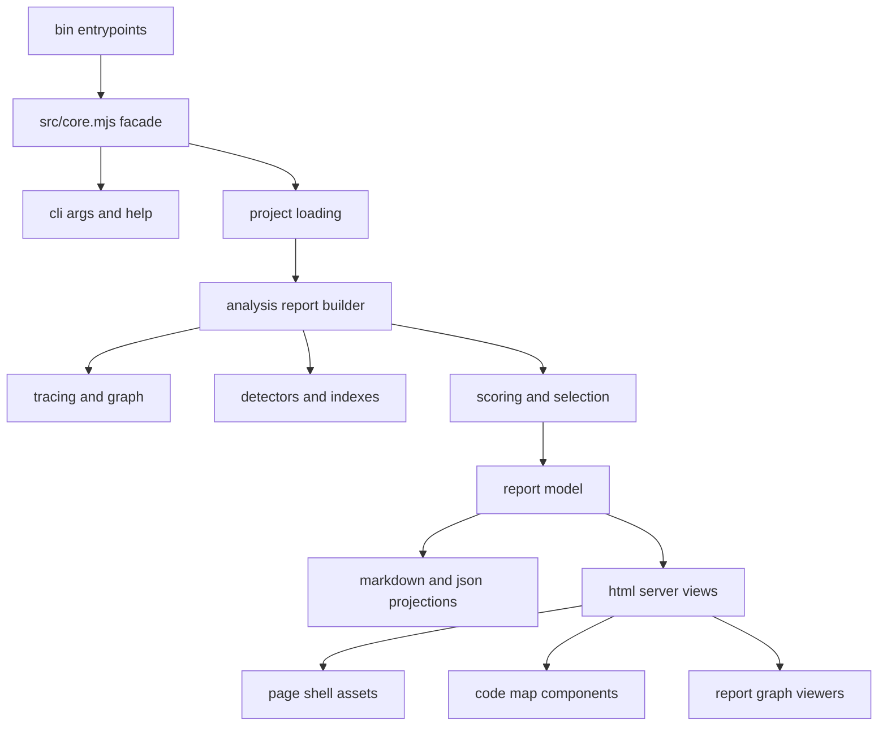

# Plan: Structural Refactoring For tsx-dataflow

## Summary

Refactor the codebase from a few large, mixed-responsibility modules into small domain modules with stable facades, shared fixture/test helpers, and separated HTML shell assets. The work should preserve current CLI, server, report, and package behavior while making the analyzer, renderers, and web UI easier to edit independently.

---

## Audit Notes (added 2026-06-29)

Verified against the codebase before editing. The plan's structural claims hold up:

- Line counts confirmed: `src/core.mjs` 8919, `src/html/code-map.mjs` 1743, `src/html/page.mjs` 949, `test/core.test.mjs` 3002, `test/server.test.mjs` 1288.
- The retired-view compare parsers are real: `core.mjs:7355-7373` reads optional `dossier.md` / `transformation-ledger.md`. KTD6 / AE6 are a genuine decision, not a hypothetical.
- `BANNED_SUGGESTION_IDENTIFIERS` (`core.mjs:305`) is export-only in `src/` and referenced only by `test/core.test.mjs:1235`. The removal-candidate note is correct.
- Current `REPORT_VIEWS` is **14 views** (overview, findings, repeated-forks, work-packets, fan-out, fan-in, path-families, defensive-ledger, prop-relay, context-relay, boundary-report, junctions, inline-preview, component-refs).

Changes made by this audit:

- **Added U0 (golden-output baseline) and made it the first thing landed.** This is the largest gap. The #1 risk is silent trace-output drift across an 8.9k-line file, yet R10 deliberately scopes golden checks narrowly and the risk mitigations lean on "representative" tests. A full snapshot of `--view all` markdown + `/api/report.json` over the example fixture, captured before any move and diffed after every unit, is the cheapest near-total safety net and changes the cost/benefit of R10. See U0 and the revised R10.
- **Corrected the example-report cleanup framing.** `examples/regenerate.mjs` already does `rm -rf` on the reports dir then `--view all`, so stale files self-heal on the next regen — this is a "run it and commit" task, not a "delete files" task. Confirmed the dir is currently stale: `overview.md` and `component-refs.md` are **missing**, and 8 retired files (`dossier`, `hotspots`, `path-census`, `path-gallery`, `repair-map`, `source-boundaries`, `transformation-ledger`, `unknown-edges`) still linger. See the revised Dead-Weight item and U14.
- **Flagged that validation is test-only.** There is no typecheck or lint script (package.json scripts: test/test:watch/analyze/serve/examples:regenerate; source is `.mjs`, so no compiler catches a broken facade re-export). Green Vitest is the *entire* safety net — reinforced in Risks with a one-line import smoke test and a one-way-import guard.
- Package manager is **pnpm** (pnpm-lock.yaml present); the plan's `pnpm test` / `pnpm examples:regenerate` commands are correct.

---

## Problem Frame

The repository has a clear product model but its implementation is concentrated in files that are too large to safely edit. `src/core.mjs` is roughly 8.9k lines and currently owns argument parsing, TypeScript project discovery, program construction, graph tracing, repeated-fork detection, helper/catalog analysis, metrics, ranking, work-packet guidance, markdown rendering, JSON projection, baseline comparison, filesystem writes, and exported query helpers. `src/html/code-map.mjs` is roughly 1.7k lines and mixes code-line rendering, path panels, detail panels, inventory rows, SVG graph generation, and full code-map assembly. `src/html/page.mjs` is roughly 950 lines because it stores the HTML shell, all CSS, and all browser behavior as inline strings.

The test suite mirrors that concentration. `test/core.test.mjs` is roughly 3k lines and mixes CLI parsing, project discovery, TypeScript config resolution, graph analysis, shape guidance, renderer assertions, compare behavior, file filtering, and repeated-fork behavior. `test/server.test.mjs` has better describe blocks, but it duplicates fixture project setup and mixes markdown, code-map units, server routes, and rich report viewers.

A deep refactor should be structural, not behavioral. It should carve out clear ownership boundaries, keep public imports stable during migration, and use the existing tests as characterization coverage before deleting or consolidating any dead weight.

---

## Requirements

- R1. Preserve the current command behavior for `tsx-dataflow`, `tsx-dataflow-serve`, `--view all`, `--format json`, `--compare`, `--baseline`, `--file`, `--scope`, and the local HTML server routes.
- R2. Keep `src/core.mjs` as a compatibility facade until downstream imports are deliberately migrated.
- R3. Split analyzer construction, project discovery, tracing, scoring, report rendering, compare logic, and filesystem output into modules with single-purpose names.
- R4. Split HTML rendering so shell CSS, shell JavaScript, code-map source rendering, detail panels, inventory rows, and graph SVGs can be edited independently.
- R5. Split server routing from server page/view rendering while preserving the one-analyzer-per-server cache model.
- R6. Replace duplicated test fixture project setup with shared test helpers before moving large test blocks.
- R7. Split tests by feature-bearing module and keep integration tests only where TypeScript program construction or HTTP routing is part of the behavior being verified.
- R8. Identify stale docs, generated example reports, compatibility parsers, and tests whose only purpose is to support retired report views, then remove or archive them only when the retained contract is explicit.
- R9. Do not introduce a generic catch-all `utils` layer for core behavior. Shared helpers should live near the domain that owns them.
- R10. Capture a full golden-output baseline (`--view all` markdown + `/api/report.json`) over the example fixture **before** any extraction (U0), and diff it after every unit. Beyond that whole-output baseline, add finer per-renderer snapshots only at stable projection boundaries where they reduce risk. "Behavior preserved" is defined as: Vitest green **and** the U0 golden diff empty (or every diff line consciously accepted).
- R11. Every public symbol re-exported by the `src/core.mjs` facade must be importable after each unit (a one-line import smoke test), and module dependencies must stay one-way (`analysis` ⇏ `reports` ⇏ `server`; `html` imports only stable report/query helpers).

---

## Key Technical Decisions

- KTD1. Use a facade-first migration. `src/core.mjs` should temporarily re-export the same public symbols while implementation moves into `src/cli`, `src/project`, `src/analysis`, `src/scoring`, `src/reports`, and `src/io`. This keeps bin scripts, server imports, tests, and package consumers working during the refactor.
- KTD2. Separate pipeline stages by data ownership. Project loading should return TypeScript programs and routing metadata; analysis should return a report model; scoring should annotate/report over that model; projection should render markdown or JSON without reaching back into TypeScript APIs.
- KTD3. Treat tracing as the highest-risk extraction. First extract low-coupling constants, graph helpers, file context, sink discovery, and defense classification; split `traceExpression` and cross-file descent after the surrounding modules are stable.
- KTD4. Keep markdown and HTML projections separate. Markdown renderers belong under `src/reports/markdown`, while web UI components belong under `src/html`. Server code can choose between them, but neither layer should import server routing.
- KTD5. Keep inline web assets but move them out of `page.mjs`. The server can still emit one self-contained HTML document, while CSS and client script live as exported strings in dedicated modules.
- KTD6. Do not delete retired-view compatibility casually. Parsers for old `dossier.md` or `transformation-ledger.md` compare directories are dead weight only if old `--view all` directories are not a supported comparison input.
- KTD7. Prefer test movement after extraction. Shared fixtures should land first, then tests should move with the modules they protect so every extraction has a focused test target.

---

## High-Level Technical Design



Target source layout:

```text
src/
  core.mjs                         # compatibility facade, thin exports only
  cli/
    args.mjs                       # parseArgs, defaults, validation, view constants
    help.mjs                       # helpText and option prose
  project/
    discovery.mjs                  # findDefaultSource, findDefaultTsconfig, walkFiles
    tsconfig.mjs                   # inspect/expand configs, routing, diagnostics
    typescript.mjs                 # loadTypescript, collectSourceFiles, buildProgram
  analysis/
    analyzer.mjs                   # analyzeProject, createAnalyzer, analyzeProgram
    report-builder.mjs             # buildReport orchestration
    graph.mjs                      # createGraph, addNode, addEdge, graph counts
    file-context.mjs               # imports, variables, accessors, scoped bindings
    sink-discovery.mjs             # getSinkExpression, JSX context, categories
    repeated-forks.mjs             # detectRepeatedForks and relateForks
    helpers.mjs                    # helper catalog, boundary classification, refs
    context-relay.mjs              # context relay findings
    tracing/
      trace-core.mjs               # traceExpression dispatcher
      trace-identifiers.mjs        # identifiers, accessors, property/element reads
      trace-calls.mjs              # local calls, cross-file calls, opaque calls
      trace-operations.mjs         # objects, binary/conditional/template operations
      defenses.mjs                 # defenseRecord, nullish verdicts, fallback origins
      cross-file.mjs               # catalog resolution, budgets, context cache
  scoring/
    metrics.mjs                    # metricsFor and reach descriptors
    ranking.mjs                    # burden/centrality/risk scores and queues
    selection.mjs                  # spread, coverage, MMR, work item selection
    work-units.mjs                 # computeWorkUnits, concentration
    shapes.mjs                     # classifyPathShape, sinkFamilyOf, pack evidence
    guidance.mjs                   # firstCutFor, candidate edits, helper names
  reports/
    render.mjs                     # renderReport, renderAllReports dispatch
    json.mjs                       # selectViewPayload, boundedGraph
    compare.mjs                    # baseline and report-directory comparison
    output.mjs                     # writeReport, writeAllReports, regen footer
    markdown/
      shared.mjs                   # tables, code spans, view intros, snippets
      overview.mjs
      findings.mjs
      repeated-forks.mjs
      work-packets.mjs
      fan.mjs
      path-and-defense.mjs
      relay.mjs
      boundaries.mjs
      component-refs.mjs
  html/
    escape.mjs                     # escapeHtml single source of truth
    page.mjs                       # page() shell only
    styles.mjs                     # inline CSS string
    client-script.mjs              # inline browser JS string
    markdown-to-html.mjs
    source-peek.mjs
    code-map/
      index.mjs                    # renderCodeMap assembly
      source-lines.mjs             # comments, hit spans, line ranges, heat
      path-panel.mjs               # step grouping and location links
      finding-panel.mjs            # finding detail/debug/defense/reach sections
      inventory.mjs                # entry rows, filters, sort metadata
      report-entry-panels.mjs      # fork, relay, unknown, helper, fan-out panels
      graphs.mjs                   # fanOutGraphSvg, boundaryGraphSvg, anchors
    report-viewers.mjs             # fanOutViewer, boundaryViewer, popover controls
  server/
    create-server.mjs              # HTTP handler, analyzer cache, refresh
    routes.mjs                     # route dispatch helpers
    overview.mjs                   # renderOverview and overview state/sort/filter
    file-page.mjs                  # renderFilePage and file tabs
    report-page.mjs                # report tabs and rich report pages
```

---

## Implementation Units

### U0. Golden-Output Baseline And Import Smoke Test

- **Goal:** Lock in a whole-system characterization net before any code moves, so trace/render drift is caught mechanically rather than by spot-checking representative tests.
- **Files:** `test/integration/golden.test.mjs`, `test/helpers/golden.mjs`, `test/integration/facade-exports.test.mjs` (and a committed `test/__golden__/` directory, or inline string fixtures if snapshots feel too noisy).
- **Plan:** Run the analyzer over `examples/bad-ish-solid` and snapshot (a) every `REPORT_VIEWS` markdown view via `renderReport`, and (b) `selectViewPayload` / `/api/report.json` for the graph payload. Snapshot deterministically — strip or freeze the regenerate footer/timestamp so diffs reflect content only. Add a second test that imports every symbol currently re-exported from `src/core.mjs` and asserts each is defined; this is the cycle/broken-facade tripwire that the test-only validation pipeline otherwise lacks.
- **Test Scenarios:** Baseline passes on the unrefactored code; deliberately perturbing one renderer makes the golden test fail (sanity-check the net itself); the import smoke test fails if any re-export is dropped.
- **Validation:** `pnpm test -- test/integration/golden.test.mjs test/integration/facade-exports.test.mjs`. Re-run after every subsequent unit; an unexpected diff blocks the merge of that unit.
- **Note:** Keep these snapshots only through the refactor. Once modules are stable, prune them to the stable projection boundaries R10 calls for, so they don't become permanent change-detector noise (see "Snapshot brittleness" risk).

### U1. Public Facade And Module Skeleton

- **Goal:** Establish the target module graph without behavior changes.
- **Files:** `src/core.mjs`, `src/cli/args.mjs`, `src/cli/help.mjs`, `src/project/discovery.mjs`, `src/reports/render.mjs`, `src/reports/output.mjs`, `test/core.test.mjs`.
- **Plan:** Move exported constants and pure entry helpers first: `REPORT_VIEWS`, argument validation, help text, source/tsconfig discovery, report dispatch, and report writing. Keep `src/core.mjs` as a thin re-export file for existing imports. Avoid touching tracing and scoring in this unit.
- **Test Scenarios:** In the existing tests, verify invalid formats/views still throw, `coverage` still normalizes to `overview`, `helpText()` lists current views, `findDefaultSource()` and `findDefaultTsconfig()` preserve discovery behavior, and `renderAllReports()` still emits exactly `REPORT_VIEWS` filenames.
- **Validation:** `pnpm test -- test/core.test.mjs` or the nearest Vitest file filter available after test splitting.

### U2. Shared Test Fixture Infrastructure

- **Goal:** Reduce test duplication before moving large describe blocks.
- **Files:** `test/helpers/fixture-project.mjs`, `test/helpers/http.mjs`, `test/core.test.mjs`, `test/server.test.mjs`.
- **Plan:** Extract the duplicated `createFixtureProject()` pattern from both test files, including default strict TS config, `--typescript-from` wiring, source-file writing, and optional parseArgs overrides. Extract the mock request/response `call()` helper from `test/server.test.mjs` into `test/helpers/http.mjs`. Keep fixture content inline at first so this unit is mechanical.
- **Test Scenarios:** Existing core and server tests should pass unchanged except imports. Add one small helper self-test only if needed to cover non-default source roots or multi-app fixtures.
- **Validation:** Full `pnpm test`, because this helper touches nearly every test.

### U3. Project Loading And TypeScript Resolution

- **Goal:** Isolate filesystem discovery, TypeScript loading, tsconfig expansion, and multi-program routing.
- **Files:** `src/project/discovery.mjs`, `src/project/typescript.mjs`, `src/project/tsconfig.mjs`, `src/analysis/analyzer.mjs`, `src/core.mjs`, `test/project/discovery.test.mjs`, `test/project/tsconfig.test.mjs`, `test/integration/analyzer.test.mjs`.
- **Plan:** Move `walkUpForTsconfig`, `ascendCollectTsconfigs`, `scanDownForTsconfigs`, `inspectTsconfig`, `referenceToConfigPath`, `resolveProjectConfigs`, `pickPrimaryConfig`, `buildTsconfigFailureMessage`, `loadTypescript`, `collectSourceFiles`, `buildProgram`, and `buildProgramRouting`. Make the analysis entry receive `{ ts, modulePath, program, routing }` from project loading instead of constructing it inline.
- **Test Scenarios:** Preserve current tests for auto-discovered root/source/tsconfig, solution-only configs, dangling references, strict optional prop behavior, path-alias imports across two apps, and loud no-config errors.
- **Validation:** Run the project discovery and monorepo tsconfig tests, then the end-to-end analyzer smoke tests.

### U4. Report Model Builder And Graph Primitives

- **Goal:** Split report construction from graph mutation and report post-processing.
- **Files:** `src/analysis/report-builder.mjs`, `src/analysis/graph.mjs`, `src/analysis/analyzer.mjs`, `src/core.mjs`, `test/analysis/graph.test.mjs`, `test/integration/analyzer.test.mjs`.
- **Plan:** Move `buildReport`, `createGraph`, `addNode`, `addEdge`, `locationOf`, `spanOf`, `summarize`, `countDistinctUnknownEdges`, `applyScope`, and file filtering helpers. Keep the report object shape unchanged. Let `analyzeProject()`, `createAnalyzer()`, and `analyzeProgram()` become small orchestration wrappers.
- **Test Scenarios:** Assert graph nodes/edges still exceed sink count for local helper traces, graph unknown edge counts remain stable, `createAnalyzer().report()` matches `analyzeProject()`, file overrides focus one file, and `/api/report.json` still returns the same top-level keys.
- **Validation:** Focused graph/report-builder tests plus `test/server.test.mjs` createAnalyzer coverage.

### U5. File Context, Sink Discovery, Helper Indexes, And Detectors

- **Goal:** Move per-file analysis helpers out of the tracing core.
- **Files:** `src/analysis/file-context.mjs`, `src/analysis/sink-discovery.mjs`, `src/analysis/repeated-forks.mjs`, `src/analysis/helpers.mjs`, `src/analysis/context-relay.mjs`, `src/analysis/report-builder.mjs`, `test/analysis/sink-discovery.test.mjs`, `test/analysis/repeated-forks.test.mjs`, `test/analysis/helpers.test.mjs`.
- **Plan:** Extract `buildFileContext`, `registerImports`, `registerVariable`, `getFileContextCached`, `identifierResolvesTo`, JSX sink/category helpers, render-prop/array callback binding helpers, repeated-fork detection/relation, component references, helper cataloging, boundary classification, caller counting, and context-relay detection. Keep `analyzeSourceFile()` as the bridge between sink discovery and tracing.
- **Test Scenarios:** Preserve coverage for JSX sink categories, event handlers excluded from ranking, same-named binding scope resolution, `<For>` callback params, custom render-prop children, array callback params, component reference indexing, context relay findings, repeated fork detection/ignores/ranking, and helper boundary/junction classification.
- **Validation:** Focused analysis tests, then the integration analyzer tests that construct fixture projects.

### U6. Tracing And Defense Modules

- **Goal:** Split the expression tracer into small, testable operation families without changing trace output.
- **Files:** `src/analysis/tracing/trace-core.mjs`, `src/analysis/tracing/trace-identifiers.mjs`, `src/analysis/tracing/trace-calls.mjs`, `src/analysis/tracing/trace-operations.mjs`, `src/analysis/tracing/defenses.mjs`, `src/analysis/tracing/cross-file.mjs`, `src/analysis/report-builder.mjs`, `test/analysis/tracing.test.mjs`, `test/integration/cross-file.test.mjs`.
- **Plan:** Move call/identifier/property/object/binary/template tracing behind a small shared context object. Keep `traceExpression()` as the dispatcher. Extract opaque-by-design call classification and unresolved-call classification with the host/global/Solid vocabularies they depend on. Keep cross-file descent and its budget in a dedicated module after basic operation tracing is stable.
- **Test Scenarios:** Preserve coverage for local helpers, imported helper tracing, `--no-trace-helpers`, `createMemo`, `createSignal`, `createResource`, first-party method calls, host/global/Solid calls, factory-produced callables, enum/DOM globals, unknown imported calls, unknown edge dedupe, optional/default defenses, parser-boundary fallbacks, and type-impossible defenses.
- **Validation:** Tracing-focused tests and selected report-render tests that assert representative paths and defense ledgers.

### U7. Scoring, Selection, Shapes, And Guidance

- **Goal:** Separate analysis facts from prioritization and recommendation language.
- **Files:** `src/scoring/metrics.mjs`, `src/scoring/ranking.mjs`, `src/scoring/selection.mjs`, `src/scoring/work-units.mjs`, `src/scoring/shapes.mjs`, `src/scoring/guidance.mjs`, `src/core.mjs`, `test/scoring/*.test.mjs`.
- **Plan:** Move `metricsFor`, reachability rollups, burden/centrality/risk scores, queue classification, selection lenses, MMR spread logic, work units, concentration, shape classification, pack grouping/evidence/verdicts, `firstCutFor`, `sinkFamilyOf`, helper-name proposal, candidate edit generation, and stop recommendation logic. Keep tests importing public facade symbols until module-level imports are stable.
- **Test Scenarios:** Preserve coverage for shape classification, banned helper-name behavior, provider/context evidence gating, sink families, pack verdicts, background findings, stop recommendation, work-packet variety, spread/coverage/quick-win selection, units mode, concentration text, and baseline diff family labels.
- **Validation:** Focused scoring tests plus `renderReport(... view: "work-packets")` integration checks.

### U8. Markdown, JSON, Output, And Compare Projections

- **Goal:** Move all report projection code out of the analyzer core.
- **Files:** `src/reports/render.mjs`, `src/reports/json.mjs`, `src/reports/compare.mjs`, `src/reports/output.mjs`, `src/reports/markdown/*.mjs`, `src/core.mjs`, `test/reports/*.test.mjs`, `test/integration/reports.test.mjs`.
- **Plan:** Extract `renderMarkdownView`, individual markdown renderers, `viewIntro`, table/code formatting, report manifest, JSON payload selection, bounded graph, baseline comparison, report-directory compare parsing, regenerate command/footer, and file writes. Group renderers by report family rather than one file per tiny helper. Keep old compare parsers isolated so they can be deleted later if the compatibility contract is dropped.
- **Test Scenarios:** Preserve coverage for every registered view, JSON graph payload, markdown code fencing, table alignment, regenerate footer, `--view all`, compare markdown output, baseline regression, current-vs-prior report directory parsing, and API markdown assets.
- **Validation:** Report-focused tests and one `pnpm examples:regenerate` run after the renderer extraction settles.

### U9. HTML Escape, Shell Assets, And Markdown HTML Renderer

- **Goal:** Remove circular HTML escaping and make the page shell easy to edit.
- **Files:** `src/html/escape.mjs`, `src/html/page.mjs`, `src/html/styles.mjs`, `src/html/client-script.mjs`, `src/html/markdown-to-html.mjs`, `src/html/source-peek.mjs`, `src/html/code-map.mjs`, `test/html/markdown-to-html.test.mjs`, `test/html/source-peek.test.mjs`, `test/server.test.mjs`.
- **Plan:** Move `escapeHtml` into `src/html/escape.mjs` and update imports from `page.mjs`, `markdown-to-html.mjs`, `source-peek.mjs`, and code-map modules. Move `STYLE` and `SCRIPT` into separate exported strings while keeping `page()` self-contained. Do not introduce an asset pipeline.
- **Test Scenarios:** Assert HTML escaping stays identical, markdown tables/fences/inline code still render, source peek popovers still rewrite references inside `<pre>`, `page()` still inlines CSS and script, and server pages still render without external assets.
- **Validation:** HTML unit tests plus server route smoke tests.

### U10. Code Map Components And Graph Viewers

- **Goal:** Split `src/html/code-map.mjs` into source rendering, inventory, panels, and graph modules.
- **Files:** `src/html/code-map/index.mjs`, `src/html/code-map/source-lines.mjs`, `src/html/code-map/path-panel.mjs`, `src/html/code-map/finding-panel.mjs`, `src/html/code-map/inventory.mjs`, `src/html/code-map/report-entry-panels.mjs`, `src/html/code-map/graphs.mjs`, `src/html/code-map.mjs`, `src/html/report-viewers.mjs`, `src/server/*.mjs`, `test/html/code-map/*.test.mjs`, `test/server.test.mjs`.
- **Plan:** Keep `src/html/code-map.mjs` as a facade while moving internals. Extract code-line rendering (`renderCommentLine`, `rangeOnLine`, `renderCodeLine`, `touchedLines`, heat hue), path rendering (`stepLocationHtml`, grouped steps, path attrs), finding details, report-entry panels, inventory row/filter metadata, fan-out/boundary SVGs, and rich report viewers currently embedded in `src/server.mjs`.
- **Test Scenarios:** Preserve coverage for line highlighting, multi-line spans, path-step numbering, defense badges, comment dimming, same-code xrefs, debug payloads, burden breakdown pills, inventory filters/sorts, fan-out SVG grouping/colors/links, boundary SVG links, and selected finding preactivation.
- **Validation:** Code-map focused tests plus `test/server.test.mjs` file-page route tests.

### U11. Server Routing And Server View Modules

- **Goal:** Make server request handling small and move page rendering into named modules.
- **Files:** `src/server.mjs`, `src/server/create-server.mjs`, `src/server/overview.mjs`, `src/server/file-page.mjs`, `src/server/report-page.mjs`, `src/server/routes.mjs`, `bin/tsx-dataflow-serve.mjs`, `test/server.test.mjs`.
- **Plan:** Keep `src/server.mjs` as a facade exporting `createServer`. Move analyzer cache, source cache, refresh, route dispatch, response helpers, overview state/sort/filter/pagination, report tabs, file tabs, report pages, and API payloads into server modules. Import rich HTML viewers from `src/html/report-viewers.mjs` rather than defining them in server code.
- **Test Scenarios:** Preserve coverage for `/`, `/report`, `/file`, `/api/report.<view>.md`, `/api/report.json`, `/refresh`, `/healthz`, 404/400/500 behavior, overview filtering/search/sort/pagination/show-all, file tab selection, report tab links, and markdown mirror pages.
- **Validation:** `test/server.test.mjs` after each route/view split.

### U12. CLI Entrypoints And Operational Scripts

- **Goal:** Keep bin scripts thin and make server-only flag parsing testable.
- **Files:** `bin/tsx-dataflow.mjs`, `bin/tsx-dataflow-serve.mjs`, `src/cli/server-flags.mjs`, `examples/regenerate.mjs`, `test/cli/*.test.mjs`, `README.md`.
- **Plan:** Move `extractServerFlags()` into a small CLI module and add direct tests. Keep `bin/tsx-dataflow.mjs` as orchestration over `parseArgs`, `analyzeProject`, `renderReport`, and output helpers. Leave `examples/regenerate.mjs` simple, but make sure regenerated report file names match current `REPORT_VIEWS`.
- **Test Scenarios:** Assert server flags are stripped before analyzer parsing, `--help` behavior is preserved, `--open` selection remains platform-aware enough for the bin script, and `examples:regenerate` removes retired reports through its existing delete-and-recreate behavior.
- **Validation:** CLI unit tests plus manual `node bin/tsx-dataflow.mjs --help` and `node bin/tsx-dataflow-serve.mjs --help` smoke checks.

### U13. Test Suite Split And Dead-Weight Cleanup

- **Goal:** Make tests navigable and remove stale coverage that no longer protects supported behavior.
- **Files:** `test/core.test.mjs`, `test/server.test.mjs`, new `test/cli`, `test/project`, `test/analysis`, `test/scoring`, `test/reports`, `test/html`, and `test/integration` files.
- **Plan:** Move describe blocks after their target modules exist. Keep integration tests for fixture projects that need the TypeScript compiler. Convert repeated issue-code comments into behavior names or source links when they still matter. Consolidate overlapping output tests with table-driven cases only after the target behavior is stable.
- **Test Scenarios:** The split itself should not add product behavior. Its success criteria are unchanged pass count, easier focused runs, and no test file over roughly 700-900 lines unless it is intentionally an integration suite.
- **Validation:** Full `pnpm test` and one focused test run per new top-level test folder.

### U14. Documentation And Generated Artifact Reconciliation

- **Goal:** Update active docs and examples so they describe the refactored code and current report surface.
- **Files:** `README.md`, `docs/analyzer.md`, `examples/regenerate.mjs`, `examples/bad-ish-solid/reports/*`, `skills/render-path-dataflow-work/SKILL.md` if public module names affect operational guidance.
- **Plan:** Update source layout docs after the modules land. Replace stale examples that mention retired markdown views such as `repair-map`, `dossier`, `path-gallery`, `path-census`, `transformation-ledger`, `hotspots`, `unknown-edges`, or `source-boundaries` as standalone current views. Run `pnpm examples:regenerate` to refresh `examples/bad-ish-solid/reports/` — its existing `rm -rf` drops the 8 retired files and adds the currently-missing `overview.md` / `component-refs.md` in one pass; commit the result. No manual deletion needed.
- **Test Scenarios:** Docs do not need unit tests, but `pnpm examples:regenerate` should produce only current report files and no broken README links to generated reports.
- **Validation:** `pnpm examples:regenerate`, link/path spot checks, and full `pnpm test` after regenerated fixtures are committed.

---

## Dead-Weight And Removal Candidates

- **Duplicated test fixture setup:** Remove the local `createFixtureProject()` definitions from `test/core.test.mjs` and `test/server.test.mjs` after U2. This is true dead weight.
- **Issue-code-only test metadata:** Replace comments/test labels like `BUG-1`, `ARCH-2`, `MD-5`, and similar local codes with behavior descriptions or links to durable docs. The behavior tests may stay; the opaque codes are mostly navigation noise.
- **Retired generated example reports (self-healing — verify, don't hand-delete):** `examples/bad-ish-solid/reports/` is currently stale: it still has 8 retired-view files (`dossier.md`, `path-census.md`, `path-gallery.md`, `repair-map.md`, `transformation-ledger.md`, `hotspots.md`, `unknown-edges.md`, `source-boundaries.md`) and is *missing* the current `overview.md` and `component-refs.md`. But `examples/regenerate.mjs` already does `rm -rf` on the reports dir before re-emitting `--view all`, so this all corrects itself on the next run — the task is "run `pnpm examples:regenerate` and commit the result," not a manual delete. Don't add per-view delete logic to `regenerate.mjs`; it would duplicate the existing wipe.
- **Active docs with retired view names:** `README.md` and `docs/analyzer.md` still mention retired standalone views. Update or delete those references as part of U14. Historical plans and feedback docs can keep old names as history.
- **Old compare-directory compatibility parsers:** `src/core.mjs` still reads retired `dossier.md` and `transformation-ledger.md` in compare mode. Keep this only if comparing against old report directories is a supported promise; otherwise remove the parser branches and tests that synthesize old retired files.
- **`BANNED_SUGGESTION_IDENTIFIERS` export:** The list is exported for tests but is not used to enforce helper-name generation. Either wire it into the guidance module as a real invariant or remove the public export and make the test assert the actual generated names.
- **Monolithic report-output smoke tests:** Tests that assert many unrelated report strings in one fixture should be split by projection or replaced with small golden-output checks at stable renderer boundaries. Remove only duplicate assertions after coverage is mapped.
- **Feedback round documents:** `docs/feedback/` has many historical walkthrough rounds. Do not delete them by default; if they are no longer active planning inputs, add `docs/feedback/README.md` or archive superseded rounds so they stop competing with current docs.

---

## Sequencing

0. Land U0 first. The golden baseline and import smoke test must exist and be green on unrefactored code before anything moves; they gate every later unit.
1. Land U1 and U2 next. They create the safe facade and fixture foundation that all later moves rely on.
2. Land U3 and U4 next. Project loading and report building are easier to extract than tracing and give the rest of the code a cleaner pipeline boundary.
3. Land U5, then U6. File context and detectors should be outside the core before the tracer is split.
4. Land U7 after the analyzer report shape is stable. Scoring and guidance are pure enough to extract once their input model is clear.
5. Land U8 before the HTML/server work. Markdown/JSON projection boundaries will simplify server imports and tests.
6. Land U9 and U10 together or back-to-back. The escape/CSS/script split lowers risk before the code-map split.
7. Land U11 and U12 after HTML modules exist. Server route modules can then import small view helpers.
8. Land U13 incrementally throughout, but finish the large test-file split only after the corresponding modules exist.
9. Land U14 last so docs and generated reports describe the final module layout rather than intermediate facades.

---

## Acceptance Examples

- AE1. Given a user runs `tsx-dataflow --view all --out reports`, when the refactor is complete, then the same current report files are emitted with the same names and content shape.
- AE2. Given code imports `parseArgs`, `analyzeProject`, `renderReport`, or `REPORT_VIEWS` from `src/core.mjs`, when the refactor is complete, then those imports still work through the facade.
- AE3. Given a TSX fixture with local helpers, imported helpers, optional fallbacks, repeated forks, and context relays, when analysis runs before and after extraction, then ranked sink ids, representative paths, defenses, helper rows, and repeated-fork rows remain equivalent.
- AE4. Given the server renders `/file?path=src/Card.tsx&finding=<id>`, when the HTML modules are split, then the selected finding still opens, path lines still highlight, and the query/hash state still restores on refresh.
- AE5. Given markdown report HTML contains `src/x.tsx:2` inside a paragraph or fenced block, when source peek is split from the shell, then the popover and open-file link still render.
- AE6. Given old report directories are intentionally supported by compare mode, when compare runs against a directory with retired `dossier.md`, then the compatibility parser is covered in `test/reports/compare.test.mjs`; otherwise those parser branches and fixtures are gone.
- AE7. Given a developer wants to change fan-out SVG rendering, when the refactor is complete, then they can edit `src/html/code-map/graphs.mjs` and run a focused graph/code-map test without loading the full analyzer mental model.

---

## Risks And Dependencies

- **Trace output drift:** Small changes in trace context or cross-file state can alter many reports. Mitigate by extracting surrounding helpers first, then comparing representative path and defense tests after every tracing move.
- **Circular imports and facade re-implementation:** A facade-first migration can hide cycles, and `.mjs` source means no compiler flags a broken or duplicated export. Keep dependencies one-way (`analysis` ⇏ `reports` ⇏ `server`; `html` imports only stable report/query helpers), back it with the U0 import smoke test, and require that `src/core.mjs` *re-exports* moved symbols and never re-implements them. Any shared mutable state (analyzer caches, context caches, the source cache) must live in exactly one module so importing through the facade vs. directly cannot create two instances.
- **Over-fragmentation:** Too many tiny files can be worse than one large file. Use module boundaries that match editing tasks, not one function per file.
- **Snapshot brittleness:** Golden reports are useful for renderer extraction but can become noisy. Use snapshots for stable sections and keep algorithm-heavy tests asserting structured fields.
- **Old artifact compatibility:** Removing retired report parsers or generated files can surprise users with old cleanup directories. Decide explicitly before deletion.
- **Docs timing:** Updating README/source layout too early will mislead readers while the facade still hides work in progress. Update docs after structural units land.

---

## Sources

- `src/core.mjs`
- `src/server.mjs`
- `src/html/code-map.mjs`
- `src/html/page.mjs`
- `src/html/markdown-to-html.mjs`
- `src/html/source-peek.mjs`
- `bin/tsx-dataflow.mjs`
- `bin/tsx-dataflow-serve.mjs`
- `test/core.test.mjs`
- `test/server.test.mjs`
- `README.md`
- `docs/analyzer.md`
- `INTENT.md`
- `skills/render-path-dataflow-work/SKILL.md`
